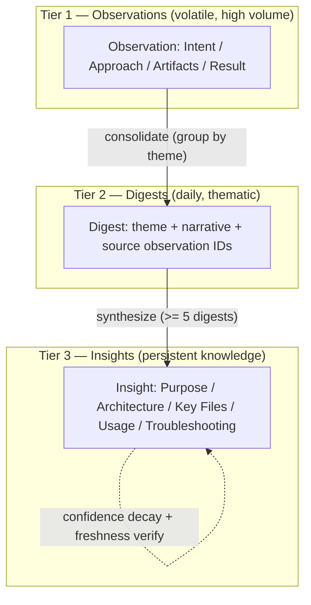
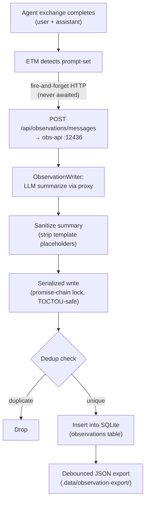
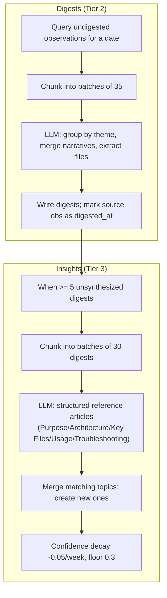
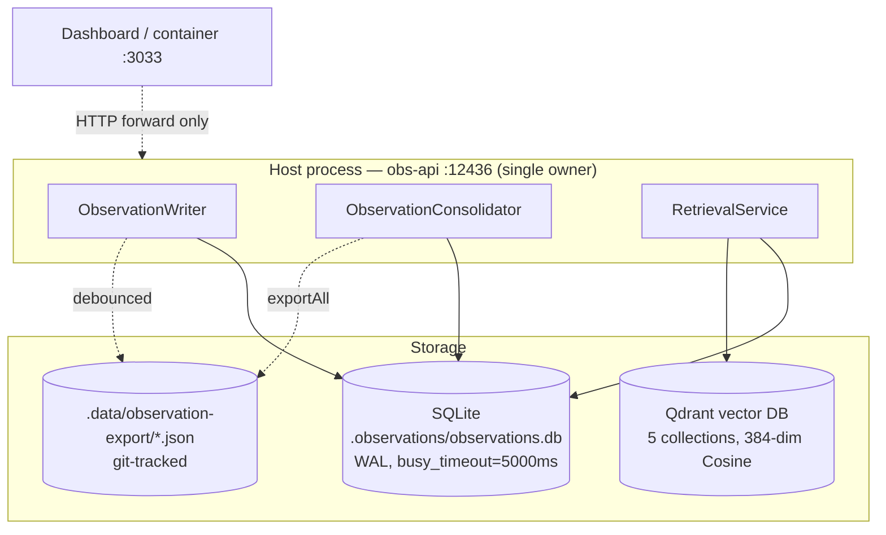
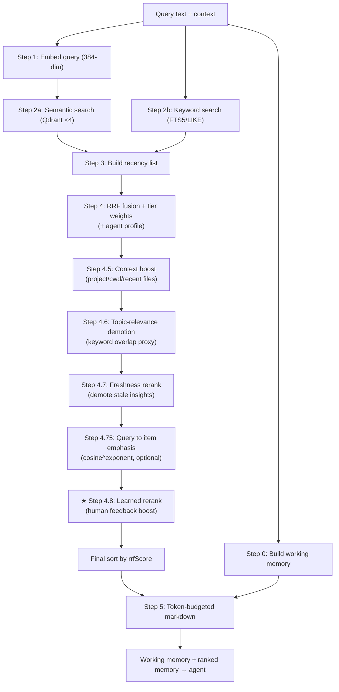
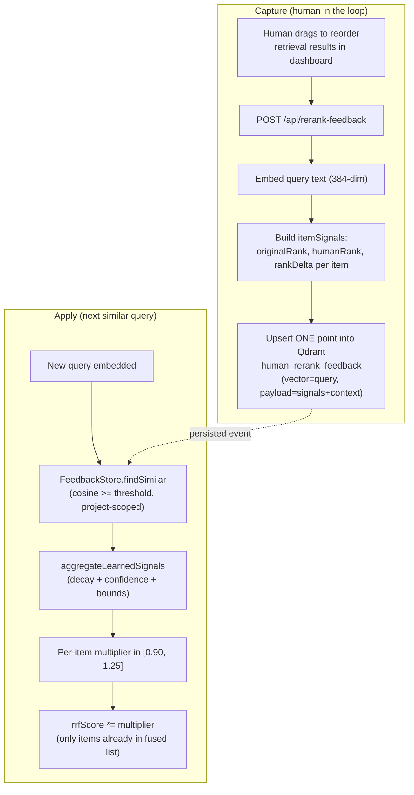
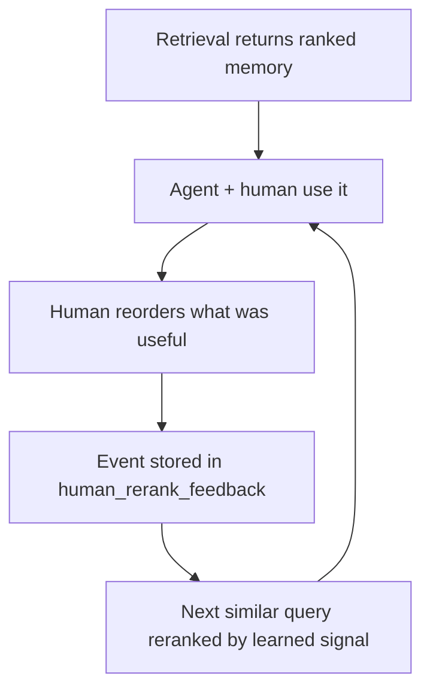

# Observational Memory

> A cross-agent, self-improving memory system that **watches** your coding
> sessions, **summarizes** them into structured knowledge, and **retrieves** the
> right slice of that knowledge back into your next prompt — continuously sharpened
> by **live human feedback**.

Observational Memory captures what happens across *all* your coding agents (Claude
Code, GitHub Copilot, OpenCode, Mastracode), distills it into a three-tier memory
hierarchy, and serves it back through a hybrid retrieval pipeline. What sets it
apart from a vanilla "embed-and-search" memory is its **Live Human-Feedback
Reranking** loop: when a human reorders retrieval results to reflect what was
actually useful, the system *learns* from that judgment and reranks future,
similar queries accordingly.

---

## Table of Contents

1. [What Makes It Different](#1-what-makes-it-different)
2. [The Three-Tier Memory Hierarchy](#2-the-three-tier-memory-hierarchy)
3. [Creation Pipeline — How Memories Are Born](#3-creation-pipeline--how-memories-are-born)
4. [Consolidation — From Observations to Knowledge](#4-consolidation--from-observations-to-knowledge)
5. [Storage Mechanism — Where Everything Lives](#5-storage-mechanism--where-everything-lives)
6. [Retrieval Pipeline — The Read Path](#6-retrieval-pipeline--the-read-path)
7. [★ Live Human-Feedback Reranking](#7--live-human-feedback-reranking-the-standout-feature)
8. [Configuration & Tuning](#8-configuration--tuning)
9. [API Quick Reference](#9-api-quick-reference)
10. [Glossary](#10-glossary)

---

## 1. What Makes It Different

Most "AI memory" systems are a single loop: embed text → store vectors → cosine
search → inject top-k. That works until the embedding model's notion of
"similar" diverges from what a human actually finds *useful*. Cosine similarity
of the `all-MiniLM-L6-v2` model clusters in a narrow `0.75–0.82` band for any two
documents from the same project, so raw vector similarity alone cannot reliably
discriminate *relevance*.

Observational Memory addresses this with three structural advantages:

| Capability | Vanilla memory | Observational Memory |
|------------|----------------|----------------------|
| **Knowledge shape** | Flat chunks | 3-tier hierarchy: Observations → Digests → Insights |
| **Retrieval** | Single vector search | Hybrid: semantic **+** keyword (FTS5) **+** recency, fused with RRF |
| **Ranking signals** | Cosine only | Tier weight, agent profile, context, topic overlap, freshness, query↔item emphasis |
| **Human in the loop** | None | **Live drag-to-reorder feedback** becomes a learned, decaying rerank boost |
| **Truth maintenance** | Stale silently | Insights are re-verified against live code; stale claims demoted |

The headline differentiator is **#7 — Live Human-Feedback Reranking**. Everything
else is the well-engineered substrate that makes that loop safe, bounded, and
fail-open.

---

## 2. The Three-Tier Memory Hierarchy

Inspired by Mastra's Observer/Reflector model and adapted for cross-agent project
knowledge, memory is organized into three tiers of increasing abstraction and
persistence.

| Tier | What it is | Trigger | Typical volume |
|------|-----------|---------|----------------|
| **Observations** | Per-exchange structured summary (Intent / Approach / Artifacts / Result) | Real-time, per prompt-set | ~30 / day |
| **Digests** | Daily thematic work-session summaries | End of day (cron or manual) | ~7 / day |
| **Insights** | Persistent, structured project knowledge articles | Weekly, or ≥ 5 new digests | ~10 total |



Each tier is queryable independently and all four contribute to retrieval, but
with different **tier weights** (insights count most; raw observations least) —
see [§6](#6-retrieval-pipeline--the-read-path).

---

## 3. Creation Pipeline — How Memories Are Born

Observations are created automatically as you work. The **Enhanced Transcript
Monitor (ETM)** watches each agent's transcript; when a prompt-set (a completed
user + assistant exchange) finishes, it fires an observation — **fire-and-forget**,
so it never blocks your session.



### Step-by-step

1. **Exchange completed** — the ETM detects a finished prompt-set.
2. **Fire-and-forget over HTTP** — `ObservationApiClient.processMessages()` POSTs
   to the host obs-api on `localhost:12436`. It is never awaited and never blocks
   live logging.
3. **LLM summarization** — inside obs-api, `ObservationWriter` calls the LLM proxy
   to produce a structured **Intent / Approach / Artifacts / Result** summary.
4. **Sanitization** — `_sanitizeSummary()` strips unfilled template placeholders
   (e.g. `[what the developer…]`) and LLM self-correction artifacts (duplicate
   `Intent:` blocks).
5. **Serialized write** — `_serializedWrite()` holds a promise-chain lock so
   concurrent fire-and-forget calls cannot race past the dedup check (TOCTOU
   prevention). Only the dedup-check + DB-write is serialized; LLM calls run
   concurrently.
6. **Dedup check** — multi-layer (see below).
7. **Storage** — written to SQLite with metadata (agent, project, LLM
   model/provider, token counts).
8. **JSON export** — debounced (~10 s coalesce) export to
   `.data/observation-export/observations.json`.

### Deduplication concepts

Observations are deduplicated *before* storage at several levels:

| Layer | Mechanism | Threshold |
|-------|-----------|-----------|
| **Content hash** | MD5 of `sessionId \| userContent \| assistantContent` | Exact match → reject |
| **Semantic dedup** | Stemmed keyword similarity over a 4-hour sliding window (last 50 obs/agent). Synonymous verbs canonicalized (`debug/diagnose/investigate → debug`), stop words stripped | Jaccard > 0.4 **or** containment > 0.7 |
| **Trivial filter** | Drops "trivial exchange" / "no actionable content" | Substring match |
| **Sanitization** | Discards unfilled-placeholder or self-corrected LLM output | Pattern match |

---

## 4. Consolidation — From Observations to Knowledge

Consolidation runs **in-process inside the obs-api server** (it already owns the
SQLite handle, so there is no second writer and no WAL race). It produces the two
higher tiers.



### Digests (Tier 2)
- **Trigger:** end of day (daemon at 02:00), manual run, or dashboard
  "Consolidate" button. The daemon skips *today* (still being written); manual
  triggers can include today via `includeToday: true`.
- **Project-aware:** observations carry a `project` column, so a session touching
  two projects yields two digests (no cross-project blending).

### Insights (Tier 3)
- **Trigger:** when ≥ 5 unsynthesized digests exist.
- **Output:** self-contained reference articles (not changelogs), optimized for
  context-priming injection.
- **Confidence:** starts ~0.8–0.95, decays −0.05 per week of inactivity, floor 0.3.

### Truthfulness & freshness verification

Insights age — a renamed file or moved route makes the prose silently rot. The
verifier extracts every backticked code claim (paths, `funcName()`, env vars,
`GET /api/…` routes, `@scoped/pkg`) and checks each against the live codebase
(repo + submodules + sibling `_work/*` checkouts), re-running on a 7-day cadence.

`verificationRatio = verifiedClaims / totalClaims` is bucketed into bands that
directly affect retrieval:

| Band | Ratio | Retrieval consequence |
|------|-------|------------------------|
| **FRESH** | ≥ 0.70 | Full retrieval weight |
| **PARTIAL** | 0.50 – 0.70 | `rrfScore *= 0.3 + 0.7 × ratio` (insight tier) |
| **STALE** | < 0.50 | Heavily demoted + one-shot confidence penalty (up to −0.20, floor 0.30) |

---

## 5. Storage Mechanism — Where Everything Lives

Observational Memory uses **three coordinated stores**: SQLite for structured
records, Qdrant for vector search, and git-tracked JSON for portability.



### 5.1 SQLite — the single-owner runtime store

The runtime DB (`.observations/observations.db`) has **exactly one owner**: the
host **Observations API server** (`scripts/observations-api-server.mjs`, port
`12436`). Every other consumer — the transcript monitor, the dashboard inside the
container, the consolidator, the retrieval pipeline — reaches the DB *only*
through this HTTP service. The `.observations` directory is **not** bind-mounted
into the container.

This eliminates the classic SQLite-on-Docker-Desktop corruption pattern (host
writer + container reader losing WAL/SHM coherence across the bind-mount). It runs
in **WAL mode** with `busy_timeout=5000ms`; the in-process writer, consolidator,
and retrieval connections coexist safely because they share the same SQLite shared
memory. One writer, everyone else over HTTP.

#### Table schemas

```sql
CREATE TABLE observations (
  id TEXT PRIMARY KEY,
  summary TEXT,            -- Intent / Approach / Artifacts / Result
  messages TEXT,           -- JSON array of original messages
  agent TEXT,              -- claude, copilot, opencode, mastra
  session_id TEXT,
  source_file TEXT,
  created_at TEXT,         -- ISO 8601
  metadata TEXT,           -- JSON: project, llmModel, llmProvider, llmTokens
  content_hash TEXT,       -- MD5 for dedup
  quality TEXT,            -- high, normal, low
  digested_at TEXT         -- set when consolidated into a digest
);

CREATE TABLE digests (
  id TEXT PRIMARY KEY,
  date TEXT NOT NULL,            -- YYYY-MM-DD
  theme TEXT NOT NULL,
  summary TEXT NOT NULL,        -- consolidated narrative
  observation_ids TEXT NOT NULL,-- JSON array of source observation IDs
  agents TEXT,                  -- JSON array
  files_touched TEXT,           -- JSON array
  quality TEXT DEFAULT 'normal',
  created_at TEXT NOT NULL,
  metadata TEXT
);

CREATE TABLE insights (
  id TEXT PRIMARY KEY,
  topic TEXT NOT NULL,
  summary TEXT NOT NULL,        -- living knowledge document
  confidence REAL DEFAULT 0.8,  -- decays -0.05/week, floor 0.3
  digest_ids TEXT NOT NULL,     -- JSON array of source digest IDs
  last_updated TEXT NOT NULL,
  created_at TEXT NOT NULL,
  metadata TEXT                 -- JSON: incl. codeVerification.verificationRatio
);
```

Observations additionally have an **FTS5** virtual table powering full-text
keyword search; digests and insights use `LIKE` fallback.

### 5.2 Qdrant — the vector store

Five collections, each **384-dimensional Cosine** (matching `all-MiniLM-L6-v2`):

| Collection | Purpose |
|------------|---------|
| `insights` | Insight embeddings (semantic search, tier weight 1.5) |
| `digests` | Digest embeddings (tier weight 1.2) |
| `kg_entities` | Knowledge-graph entity embeddings (tier weight 1.0) |
| `observations` | Observation embeddings (tier weight 0.8) |
| `human_rerank_feedback` | **One point per human rerank event** — powers [§7](#7--live-human-feedback-reranking-the-standout-feature) |

### 5.3 Git-tracked JSON export

Mirroring the UKB knowledge-export pattern, the system exports human-readable,
diff-friendly JSON to `.data/observation-export/` for cross-machine portability
and backup:

| File | Content |
|------|---------|
| `observations.json` | Summaries + metadata (excludes raw `messages`) |
| `digests.json` | Daily thematic digests |
| `insights.json` | Persistent insights + confidence |
| `metadata.json` | Export timestamp + counts |

Triggers: after each write (debounced 10 s, observations only), and a full
`exportAll()` after each consolidation run.

---

## 6. Retrieval Pipeline — The Read Path

When an agent submits a prompt, the retrieval pipeline assembles a token-budgeted
slice of memory to prime its context. Retrieval is **hybrid** (semantic + keyword
+ recency) and **fused** with Reciprocal Rank Fusion, then refined by a sequence
of reranking passes before the final token-budgeted markdown is built.

### 6.1 Core concepts

| Concept | What it is |
|---------|-----------|
| **Embeddings** | `all-MiniLM-L6-v2`, 384-dim, cosine. Query embedded once (`embedOne`), ~20 ms warm. |
| **Semantic search** | Qdrant search across the 4 content collections in parallel, ≤ 20 hits each, `score_threshold` (default 0.70 via settings). |
| **Keyword search** | SQLite **FTS5 MATCH** for observations, `LIKE` for digests/insights — catches exact terms embeddings miss. |
| **Recency** | Exponential decay, 14-day half-life: `score = 0.5 ^ (ageDays / 14)`. |
| **RRF** | Reciprocal Rank Fusion: each list contributes `1 / (k + rank + 1)`, `k = 60`. Rank-based, so it is robust to incomparable raw scores. |
| **Tier weights** | After fusion: insights ×1.5, digests ×1.2, kg_entities ×1.0, observations ×0.8. |
| **Agent profiles** | Optional per-agent tier multipliers (a second pass on top of tier weights). |
| **Working memory** | A small always-on prefix (VKB team, project STATE) built per-query. |
| **Token budget** | `gpt-tokenizer` counts tokens; per-tier reserved slots + caps guarantee a blend (insights first, observations last). |

### 6.2 The pipeline, stage by stage



Each pass mutates an `rrfScore` on the fused candidates:

- **4.5 Context boost** — multiplicative: project match ×1.15 (or ×0.5 for a
  *different* labelled project), cwd path-segment match ×1.10, recent-file
  basename match ×1.20.
- **4.6 Topic-relevance demotion** — because MiniLM cosines cluster at 0.75–0.82
  within a project, keyword overlap between query and a result's topic/theme is
  used as a discriminating proxy to demote off-topic hits.
- **4.7 Freshness rerank** — for the `insights` tier only, multiply `rrfScore` by
  `0.3 + 0.7 × verificationRatio` so a fully-fresh insight is untouched and a
  fully-stale one drops to 0.3× (never fully filtered).
- **4.75 Query↔Item emphasis** *(optional, user-tunable)* — RRF is rank-based and
  discards the raw cosine, so when enabled this multiplies each semantic-origin
  item's score by `clamp(cosine, 0, 1) ^ exponent`. Keyword/recency-only items
  (no true cosine) are left untouched.
- **4.8 Learned rerank** — the human-feedback boost; see [§7](#7--live-human-feedback-reranking-the-standout-feature).

Finally, candidates are re-sorted, the token-budgeted markdown is assembled
(reserving slots per tier so insights/digests actually reach the agent rather than
being crowded out by high-volume observations), and the working-memory prefix is
prepended. Items actually emitted are flagged `usedInObservational` for dashboard
provenance pills.

---

## 7. ★ Live Human-Feedback Reranking (the standout feature)

This is the capability that elevates Observational Memory above a vanilla
retrieval pipeline. **A human can reorder retrieval results to reflect what was
actually useful, and the system learns from that judgment** — applying a bounded,
decaying, confidence-weighted boost to similar future queries.

It implements the approved design *"Feedback Loop Design: Human Re-Ranking as a
Learned Path-A Boost"*. Two phases: **capture** and **apply**.



### 7.1 Capture — turning a reorder into a learning signal

When a human reorders results in the dashboard live-context view, the client
sends the query plus the before/after ordering to `POST /api/rerank-feedback`.
The obs-api:

1. Embeds the **query text** (must be 384-dim).
2. Builds one `itemSignals` entry per item, capturing its stable `itemKey`
   (`tier:id`), `originalRank`, the human-chosen `humanRank`, and the
   `rankDelta = originalRank − humanRank`.
3. **Upserts a single Qdrant point** into `human_rerank_feedback` — vector = the
   query embedding, payload = the item signals plus scope context (`project`,
   `agent`, `cwd`, `sessionId`, `userHash`, `capturedAt`, `schemaVersion`).

One human save = one compact, query-keyed event. A `GET /api/rerank-feedback`
endpoint provides an audit view (vectors omitted).

### 7.2 Apply — the learned boost at query time

On the next retrieval, `_applyLearnedRerank` (Step 4.8) consults the feedback
store. `FeedbackStore.findSimilar` searches `human_rerank_feedback` for events
whose stored **query embedding** is cosine-similar to the current query
(default threshold 0.85), **project-scoped first**, with an optional reduced-weight
global fallback only when project matches are sparse.

Matched events are aggregated by the **pure, deterministic, time-injectable**
`aggregateLearnedSignals()` (no I/O — unit-testable without Qdrant):

```text
similarityWeight = exponentialEnabled ? clamp(score, 0, 1) ^ exponent : score
ageWeight        = 0.5 ^ (ageDays / HALF_LIFE_DAYS)        // default half-life 45 days
eventWeight      = similarityWeight × ageWeight × scopeWeight × userWeight
deltaNorm        = clamp((originalRank − humanRank) / max(windowSize − 1, 1), −1, 1)
weightedDelta    = Σ(deltaNorm × eventWeight) / max(Σ eventWeight, ε)
confidence       = min(1, Σ|eventWeight| / CONFIDENCE_DIVISOR)   // divisor default 1.5
learnedSignal    = clamp(weightedDelta × confidence, −1, 1)
multiplier       = clamp(1 + COEFFICIENT × learnedSignal, MIN, MAX)  // 0.30, [0.90, 1.25]
```

The multiplier is applied as `item.rrfScore *= multiplier` — but **only** to items
already present in the fused candidate list (missing-candidate recall is
deliberately out of scope). Each boosted item carries a `learnedRerank`
`{ multiplier, signal, matchedEvents }` object for explainability, surfaced as a
dashboard pill.

### 7.3 Why this is safe — design guarantees

| Guarantee | How |
|-----------|-----|
| **Fail-open** | Any Qdrant error, missing collection, or zero matches → `[]` and a no-op multiplier of 1.0. Learned rerank can never degrade baseline retrieval. |
| **Bounded** | Multiplier hard-clamped to `[0.90, 1.25]` — always weaker than context/topic signals, so feedback nudges rather than dominates. |
| **Decaying** | Exponential 45-day half-life: stale opinions fade automatically. |
| **Confidence-weighted** | A single weak event barely moves the score; agreement across many strong, recent, similar events is required for a full boost. |
| **Query-similarity-gated** | The optional `score^exponent` reshape concentrates influence on near-duplicate queries; loosely-similar past queries contribute little. |
| **Scoped** | Project-scoped by default; global fallback is off unless explicitly enabled and runs at higher threshold + reduced weight. |
| **Explainable** | `learnedRerank` metadata records exactly why an item was boosted. |

### 7.4 The self-improving loop



Over time, the system's ranking converges toward **human-validated usefulness**
for the queries that matter most — something pure embedding similarity cannot do.

---

## 8. Configuration & Tuning

### 8.1 Retrieval settings (`.observations/retrieval-settings.json`)

A single JSON file is the **single source of truth** read by `retrieve()`, so the
UserPromptSubmit hook and the dashboard live preview honor identical values. It
exposes two similarity stages, each with `threshold`, `exponentialEnabled`, and
`exponent`:

| Stage | Controls | Default threshold | Default exponential |
|-------|----------|-------------------|---------------------|
| `queryQuery` | Learned-rerank gate (query↔query similarity) | 0.85 | enabled, exponent 3.0 |
| `queryItem` | Semantic admission + emphasis (query↔item similarity) | 0.70 | disabled, exponent 3.0 |

Bounds: threshold `[0.5, 0.99]`, exponent `[1.0, 8.0]`. Reads/writes are
fail-open (defaults on error) and atomic (tmp file + rename).

### 8.2 Learned-rerank env overrides

All tuning constants are env-overridable, so the loop can be tuned without code
changes:

| Env var | Default | Meaning |
|---------|---------|---------|
| `LEARNED_RERANK_THRESHOLD` | 0.85 | Cosine floor for a feedback event to apply |
| `LEARNED_RERANK_TOPK` | 10 | Max feedback events fetched per query |
| `LEARNED_RERANK_HALF_LIFE_DAYS` | 45 | Age decay half-life |
| `LEARNED_RERANK_COEFFICIENT` | 0.30 | Boost coefficient |
| `LEARNED_RERANK_MIN_MULTIPLIER` / `MAX_MULTIPLIER` | 0.90 / 1.25 | Hard multiplier bounds |
| `LEARNED_RERANK_CONFIDENCE_DIVISOR` | 1.5 | Confidence normalizer |
| `LEARNED_RERANK_GLOBAL` | off | Enable reduced-weight cross-project fallback |

### 8.3 Observation creation (`.observations/config.json`)

Per-agent LLM model selection and token limits, e.g. default
`anthropic/claude-haiku-4-5`. Summarization routes through the LLM CLI proxy
(`localhost:12435`) with automatic provider fallback (claude-code → copilot →
groq → paid APIs), priority configured in `config/llm-providers.yaml`.

---

## 9. API Quick Reference

All endpoints are served by the host obs-api (`localhost:12436`) and mirrored by
the dashboard (`localhost:3033`) as thin HTTP forwarders.

| Endpoint | Method | Purpose |
|----------|--------|---------|
| `/api/retrieve` | POST | Hybrid retrieval for a query (returns markdown + ranked results + meta) |
| `/api/rerank-feedback` | POST | **Capture a human-reordered result list** → one `human_rerank_feedback` event |
| `/api/rerank-feedback?limit=N` | GET | Audit recent rerank events (vectors omitted) |
| `/api/observations` | GET | Paginated observations (agent/date/project/quality/FTS filters) |
| `/api/observations/messages` | POST | (host only) Summarize + dedup + insert a message chunk |
| `/api/digests` | GET | Paginated digests |
| `/api/insights` | GET | All insights (topic/text filter) |
| `/api/projects/:project/coverage` | GET | Per-project truthfulness + coverage summary |
| `/api/consolidation/status` | GET | Counts: total/undigested/pending, digests, insights |
| `/api/consolidation/run` | POST | Trigger consolidation (optional `{ date }`) |

---

## 10. Glossary

| Term | Definition |
|------|-----------|
| **Observation** | Tier-1 per-exchange structured summary (Intent/Approach/Artifacts/Result). |
| **Digest** | Tier-2 daily thematic summary grouping related observations. |
| **Insight** | Tier-3 persistent, structured knowledge article with a confidence score. |
| **obs-api** | The single-owner host server (port 12436) that exclusively owns the SQLite DB. |
| **RRF** | Reciprocal Rank Fusion — combines ranked lists via `1/(k+rank+1)`. |
| **Tier weight** | Post-fusion multiplier reflecting a tier's trustworthiness (insights highest). |
| **Recency score** | Exponential time decay (14-day half-life) used as a third fusion list. |
| **Working memory** | Always-on context prefix (team/project state) prepended to retrieval output. |
| **Freshness band** | FRESH/PARTIAL/STALE classification of an insight by code-claim verification ratio. |
| **Learned rerank** | The bounded, decaying boost derived from human re-ranking feedback. |
| **`human_rerank_feedback`** | Qdrant collection storing one query-keyed event per human reorder. |
| **itemSignals** | Per-item `originalRank`/`humanRank`/`rankDelta` records inside a feedback event. |
| **learnedSignal** | Confidence-weighted, clamped rank-delta that drives the rerank multiplier. |
| **Fail-open** | Design principle: any failure degrades to current behavior, never worse. |

---

### Related documentation

For dashboard screenshots and an image-rich walkthrough, see
[`docs-content/core-systems/observational-memory.md`](docs-content/core-systems/observational-memory.md).
