# Coding - AI Development Toolkit

A comprehensive AI-powered development toolkit featuring live session logging, real-time constraint monitoring, semantic knowledge management, and multi-agent analysis — supporting Claude Code, GitHub Copilot CLI, OpenCode, and Mastracode. **Zero-cost LLM routing** via existing Claude Code and GitHub Copilot subscriptions.

---

## 🚀 Quick Start

```bash
# Install the system (safe - prompts before any system changes)
./install.sh

# Start Claude Code with all features
coding

# Or use specific agent
coding --claude
coding --copilot
coding --opencode
coding --mastra

# Clean start (kills all orphaned processes, frees ports)
coding --force

# Query local LLM from command line (Docker Model Runner)
llm "Explain this error message"
cat file.js | llm "Review this code"
```

### 🐳 Docker Deployment

The coding stack runs in Docker — there is no native fallback.

```bash
# Start Claude or CoPilot — Docker services start automatically
coding --claude
coding --copilot
```

**Benefits**: Persistent MCP servers, shared browser automation across sessions, isolated database containers, no duplicate containers when switching agents.

**MCP Configuration**: `claude-mcp-launcher.sh` wires the stdio-proxy → SSE bridge so the agent talks to the containerized MCP servers.

**Unified Agent Launching**: All agents are wrapped in tmux sessions via the shared `scripts/tmux-session-wrapper.sh`, providing a consistent status bar across Claude, CoPilot, OpenCode, and Mastracode. The shared orchestrator (`scripts/launch-agent-common.sh`) handles service startup, monitoring, session management, and **auto-installation of missing agent CLIs** — adding a new agent requires only a single config file in `config/agents/`. The service orchestrator (`start-services-robust.js`) treats Redis, Qdrant, and Memgraph as built-ins of the coding-services container, so it never spawns duplicates.

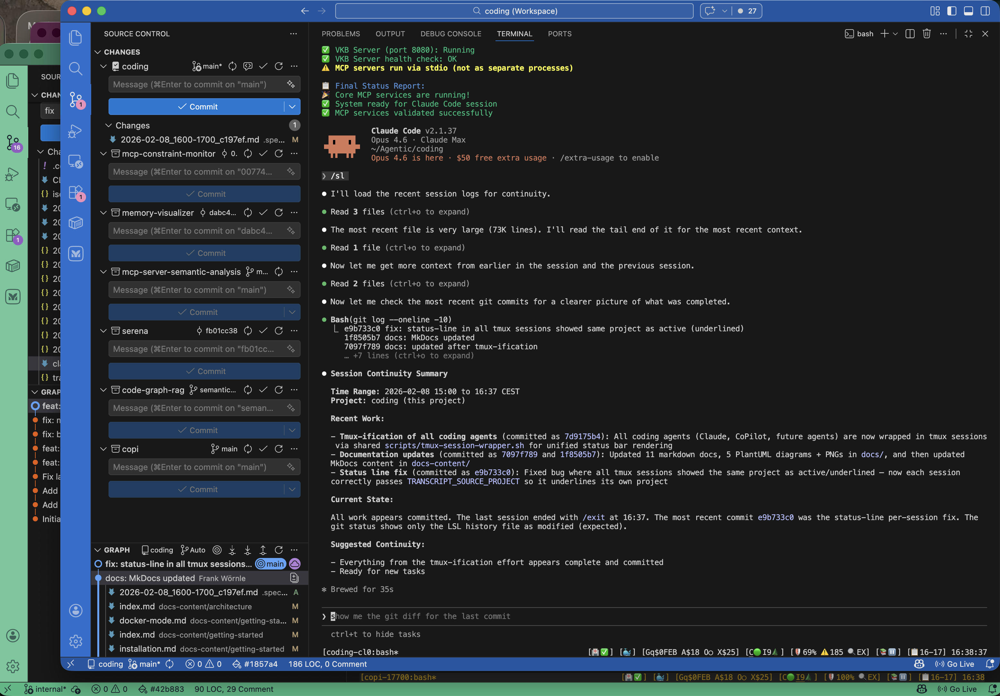

**Multi-Agent Support**: While Claude Code is the primary and default agent (`coding` or `coding --claude`), the system is fully agent-agnostic. Any coding agent can be integrated with a single config file in `config/agents/`. Currently supported:

| Agent | Launch Command | Detection |
|-------|---------------|-----------|
| **Claude Code** (default) | `coding` or `coding --claude` | Native transcript support |
| **GitHub Copilot CLI** | `coding --copilot` | Pipe-pane I/O capture |
| **OpenCode** | `coding --opencode` | Pipe-pane I/O capture |
| **Mastracode** | `coding --mastra` | Lifecycle hook transcripts |

All agents get the same infrastructure: tmux session wrapping, status line, health monitoring, LSL session logging, knowledge management, constraint enforcement, and **shared skills** (see [Skills System](docs/skills-system.md)). Missing agent CLIs are auto-installed on first launch (with user confirmation).

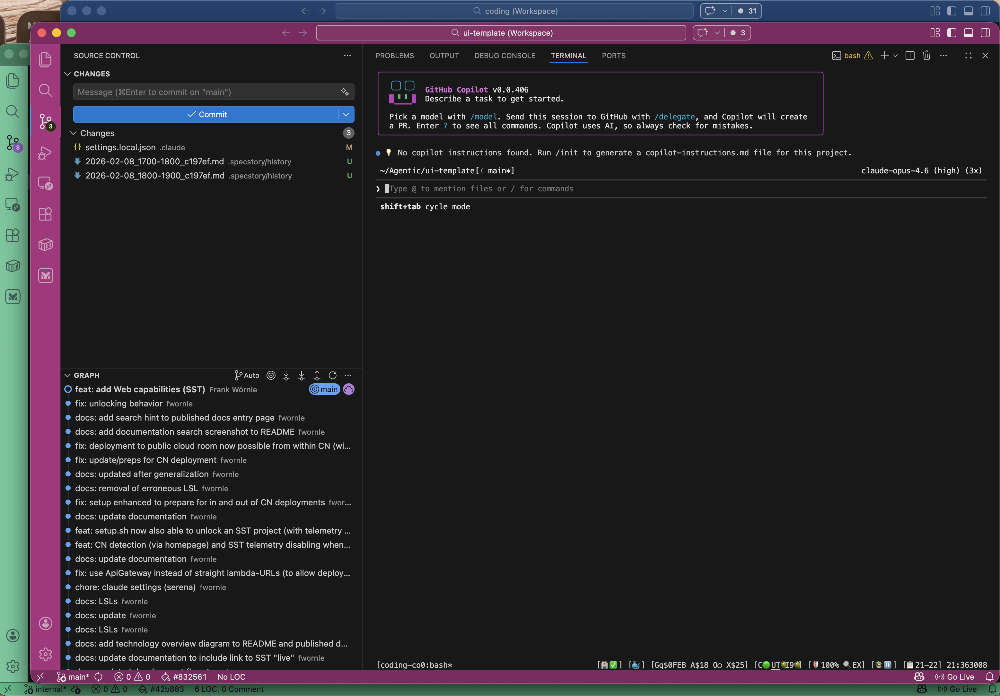

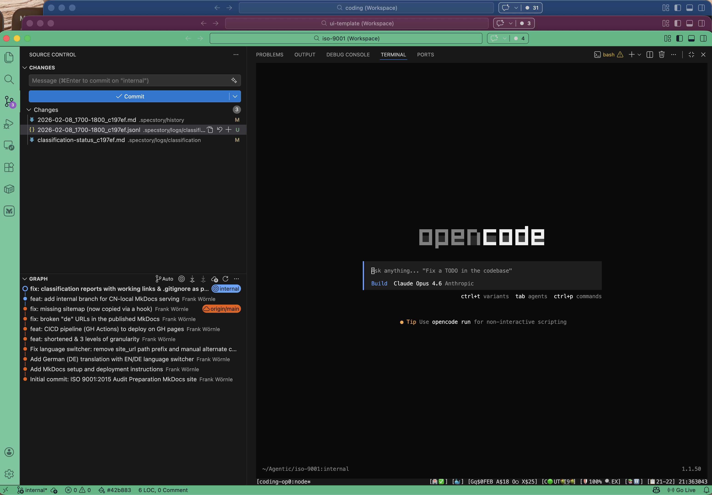


See [Agent Integration Guide](docs/agent-integration-guide.md) for adding new agents.

**Health System**: The health verifier reads cached commit info from `cache-metadata.json` (no `.git` inside the container) and uses supervisorctl for service restarts.

The Docker stack runs 4 containers (coding-services, Qdrant, Memgraph, Redis) with 10 internal services managed by supervisord, using ~1.75 GB memory total. The only host-side service is the LLM CLI Proxy (port 12435), which bridges to host-local CLI tools like Claude Code and GitHub Copilot.

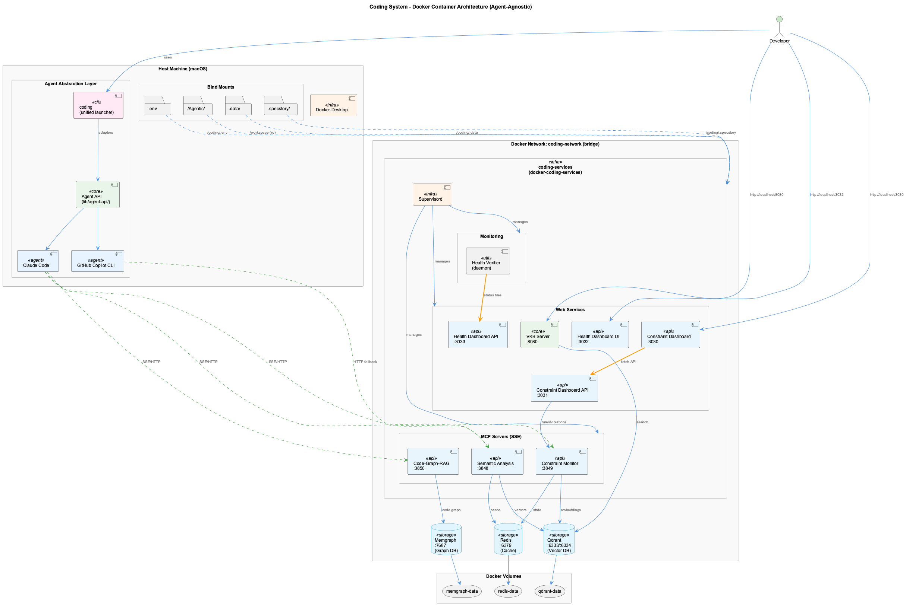

See [Architecture Report](docs/architecture-report.md) for full system overview, and the [Docker Deployment Guide](docker/README.md) for container configuration.

### Environment Resilience

The launcher automatically adapts to your network environment:
- **Corporate network detection** — 3-layer detection (environment variable, SSH probe, HTTPS fallback) with 5-second timeouts
- **Proxy auto-configuration** — Detects local proxy services (proxydetox) and configures environment variables automatically
- **Docker build proxy** — Build-time proxy is driven by the same VPN detection (see below)
- **Docker auto-start** — Launches Docker Desktop on demand with hung-process recovery and 45-second timeout
- **Tested in all combinations** — CN/public network, with/without proxy, Claude/CoPilot — validated by 17 end-to-end tests

No manual network configuration needed for most environments. See [Getting Started - Network Setup](docs/getting-started.md#network-setup-corporateproxy) for details.

#### Docker Build Proxy Management

The Docker **build** (compiling `coding-services`) fetches OS packages via `apt-get`
and npm/Python dependencies, so it needs working network access at build time.
Docker normally auto-injects `http_proxy`/`https_proxy` build-args from
`~/.docker/config.json`. On a corporate laptop that proxy often points at a
host-only address (e.g. `127.0.0.1` rewritten to the Docker bridge gateway) which
is **unreachable from inside the build container when off-VPN** — causing
`apt-get update` to fail with `Unable to locate package ...`.

The launcher resolves this automatically, keyed to the corporate-VPN detection
(`INSIDE_CN`):

| State | Build proxy behavior |
|-------|----------------------|
| **Inside CN** (on VPN) | Passes the detected proxy through to the build (`http_proxy`/`https_proxy` build-args) |
| **Outside CN** (off VPN) | Forces the build-args **empty**, overriding any proxy from `~/.docker/config.json` so the build goes direct |

This is implemented in `_configure_docker_build_proxy()`
([scripts/launch-agent-common.sh](scripts/launch-agent-common.sh)), which exports
`DOCKER_BUILD_HTTP_PROXY` / `DOCKER_BUILD_HTTPS_PROXY` / `DOCKER_BUILD_NO_PROXY`.
These feed the `build.args` block in
[docker/docker-compose.yml](docker/docker-compose.yml). No manual configuration is
needed.

**Overrides** (rarely needed):
- `CODING_DOCKER_BUILD_PROXY=http://host:port` — force a specific build proxy (takes precedence when inside CN)
- `CODING_FORCE_CN=true|false` — force VPN detection on/off, which also flips the build proxy

### Installation Safety

The installer follows a **non-intrusive policy** - it will NEVER modify system tools without explicit consent:

- **Confirmation prompts** before installing any system packages (Node.js, Python, jq)
- **Skip options**: `y` (approve), `N` (skip), `skip-all` (skip all system changes)
- **Shell config backup** with timestamped files before any modifications
- **Syntax verification** after shell config changes

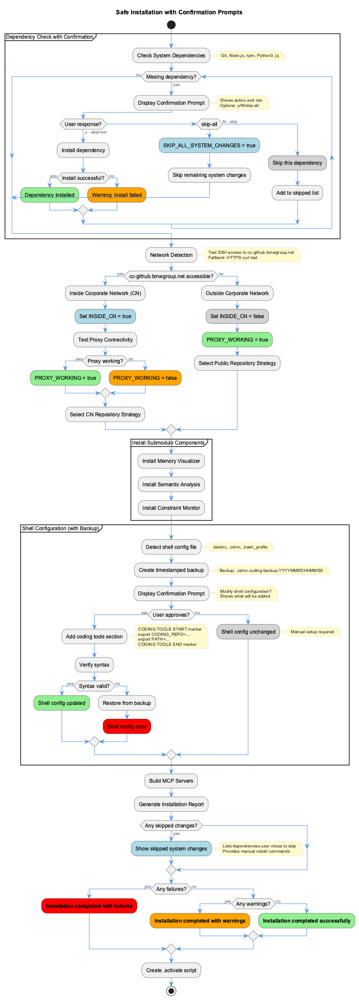

**Next Steps**: [Getting Started Guide](docs/getting-started.md)

---

## 🎯 What It Provides

### Core Capabilities

- **🏥 Health System** - Real-time monitoring, auto-healing, and status line indicators
- **📋 Live Session Logging** - Real-time conversation classification and routing
- **🔒 Constraint Monitoring** - PreToolUse hook enforcement for code quality
- **🧠 Knowledge Management** - Capture, visualize, and share development insights
- **👁️ Observational Memory** - Per-exchange LLM observations from live sessions, browsable dashboard
- **🤖 Multi-Agent Analysis** - 11 specialized AI agents for comprehensive code analysis

### LLM Providers (Zero-Cost Routing)

The unified LLM layer (`lib/llm/`) intelligently routes requests to maximize cost savings:

- **Subscription-First**: Claude Code → GitHub Copilot → Groq → Anthropic → OpenAI
- **10 Providers**: 2 subscription (CLI), 5 cloud API, 2 local, 1 mock
- **Automatic Fallback**: Quota exhausted? Seamlessly fall back to paid APIs
- **Quota Tracking**: Persistent usage tracking with exponential backoff
- **Cost Savings**: ~$50-100/month for active development (all UKB/LSL analysis is $0)

**Provider Status**:
- ✅ Claude Code (sonnet/opus) - **Zero cost** via subscription
- ✅ GitHub Copilot (gpt-4o-mini/gpt-4o) - **Zero cost** via subscription
- ✅ Groq (llama-3.1/3.3) - Fast, low-cost API fallback
- ✅ Anthropic, OpenAI, Gemini, GitHub Models - Cloud API fallback
- ✅ DMR, Ollama - Local fallback (no API costs)

See [LLM Architecture](docs-content/architecture/llm-architecture.md) for details.

### Integration Support

- **Claude Code** - Full MCP server integration (default agent)
- **GitHub Copilot CLI** - Pipe-pane capture with session logging
- **OpenCode** - Pipe-pane capture with session logging
- **Agent Abstraction API** - Unified adapter system for any coding agent
- **Docker Support** - Containerized deployment with HTTP/SSE transport for MCP servers

### Agent Abstraction Architecture

The system uses a unified Agent Abstraction API (`lib/agent-api/`) that enables consistent features across different coding agents:

- **BaseAdapter** - Common interface for all agent adapters
- **StatuslineProvider** - Unified status display (rendered via tmux status bar)
- **HooksManager** - Bridge between native hook systems and unified hooks
- **TranscriptAdapter** - Unified session log format (LSL)

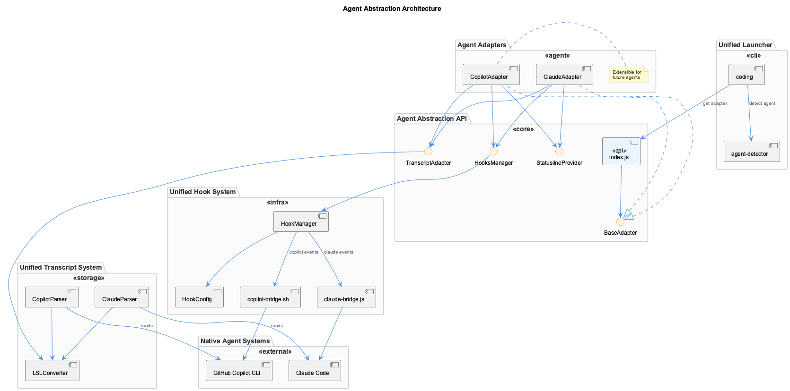

See [Agent Abstraction API](docs/architecture/agent-abstraction-api.md) for details.

---

## 📚 Documentation

### Core Systems

#### [🏥 Health System](docs/health-system/)
Automatic health monitoring and self-healing with real-time dashboard
- Pre-prompt health verification with 3-layer resilience
- Auto-healing failed services (Docker-aware)
- Dashboard at `http://localhost:3032`
- Service supervision hierarchy ensures services stay running
- **[📊 Status Line System](docs/health-system/status-line.md)** - Real-time indicators via unified tmux status bar (all agents)

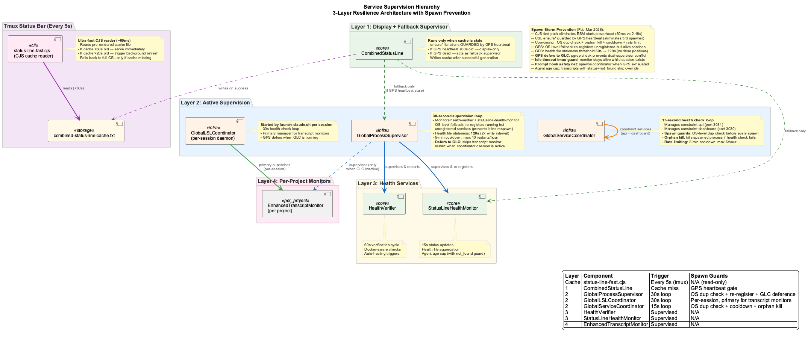

#### [📊 Token Usage Telemetry](docs/architecture/token-usage.md)
Real-time LLM token-consumption visibility on the Health Dashboard (`http://localhost:3032/token-usage`).
- Every `/api/complete` call through the LLM CLI Proxy (port `12435`) is recorded with provider, model, process, token counts and latency
- The proxy serves `/api/token-usage/summary`, `/api/token-usage/recent` and `/api/llm/settings`, read directly by the dashboard
- Per-hour, per-user JSON exports under `.data/llm-proxy-export/` survive restarts and merge across teammates after `git pull`
- Per-process provider pins (the ⚙ Settings dialog) let you force a service to a specific provider + model

The repo wrapper (`src/llm-proxy/llm-proxy.mjs`) fronts the upstream `@rapid/llm-proxy` package: it starts the package on an internal port and exposes the token-usage endpoints on `12435` while transparently proxying completions and recording usage.

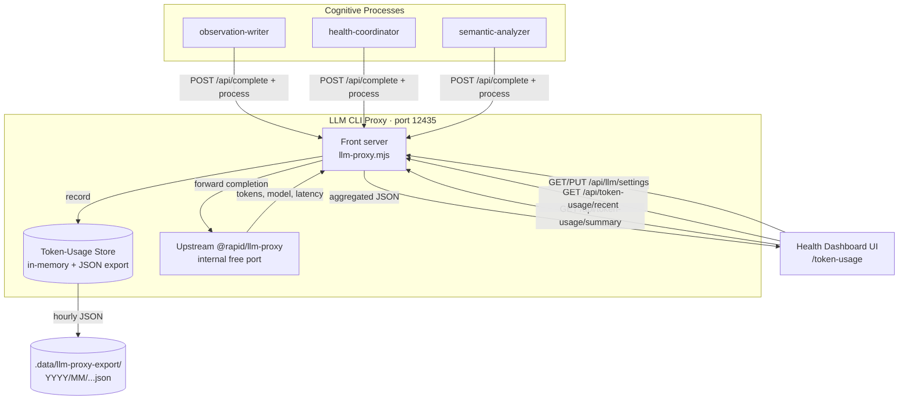

##### 🩺 LLM-Proxy Liveness Auto-Heal (3-second watchdog)

The `health-coordinator` continuously supervises the LLM CLI Proxy so it never
stays down. Two cooperating layers heal it:

- **3-second liveness watchdog** — probes `GET /health` every 3s. If the proxy
  fails (`HTTP ≠ 200`) or does not respond (crash → `ECONNREFUSED`, hang →
  timeout), it is restarted immediately.
- **60-second semantic FSM** — probes a real `POST /api/complete` and restarts
  on sustained quality failure (`semantic_ok=false`).

Restarts are **cross-platform** (macOS `launchctl`; Linux/Windows free port
`12435` and respawn the wrapper detached), **serialized** to avoid `EADDRINUSE`
races, and guarded by a **20-second post-restart settle window** so a freshly
spawned proxy is never restarted while its upstream is still warming up. State
is surfaced on `GET /health/state` (`proxy.liveness_ok`, `liveness_restart_count`).

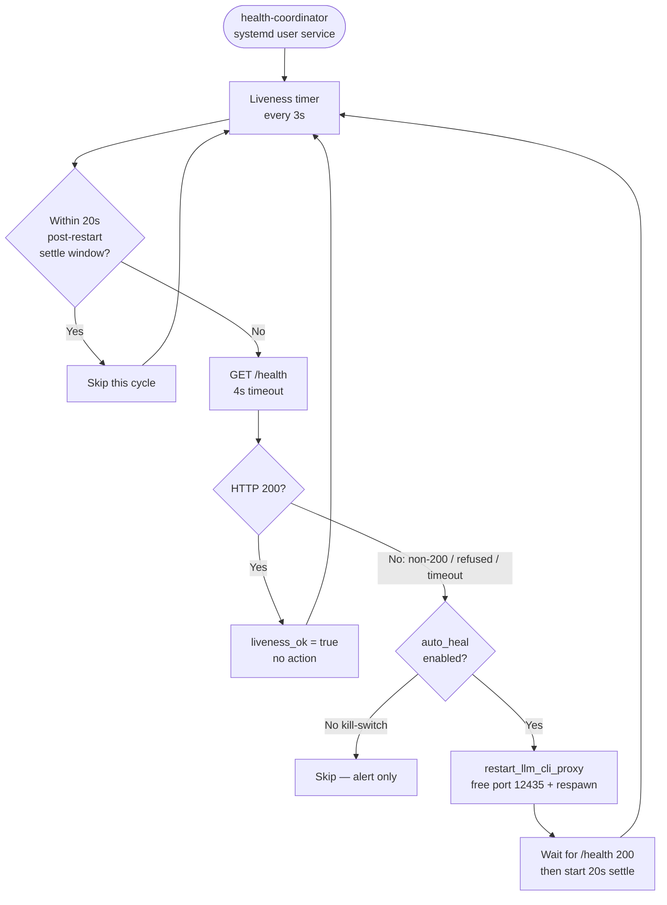


#### [📋 Live Session Logging (LSL)](docs/lsl/)
Real-time conversation classification and routing with security redaction
- 5-layer classification system
- Multi-project support with foreign session tracking
- 98.3% security effectiveness
- Zero data loss architecture

#### [📈 Trajectories](docs/trajectories/)
Real-time development state tracking and comprehensive project analysis
- AI-powered activity classification (exploring, implementing, verifying, etc.)
- Status line integration
- Automated project capability documentation

#### [🔒 Constraints](docs/constraints/)
Real-time code quality enforcement through PreToolUse hooks
- 18 active constraints (security, architecture, code quality, PlantUML, documentation)
- Severity-based enforcement (CRITICAL/ERROR blocks, WARNING/INFO allows)
- Dashboard monitoring at `http://localhost:3030`
- Compliance scoring (0-10 scale)

#### [🧠 Knowledge Management](docs/knowledge-management/)
**Two Complementary Approaches** for knowledge capture and retrieval:
- **Manual/Batch (UKB)**: Git analysis and interactive capture for team sharing
- **Online (Continuous Learning)**: Real-time session learning with semantic search
- **Visualization (VKB)**: Web-based graph visualization at `http://localhost:8080`
- **Ontology Classification**: 4-layer classification pipeline

#### [👁️ Observational Memory](docs/observations/)
Real-time per-exchange observations from live coding sessions, inspired by the observational memory concepts in the Mastra codebase:
- **Structured LLM summaries**: Each exchange summarized into Intent/Approach/Artifacts/Result via subscription providers
- **Multi-agent capture**: All four agents (Claude, Copilot, OpenCode, Mastracode) generate observations
- **Dashboard**: Browsable at `http://localhost:3032/observations` with filters, search, compact view
- **Auto-fallback**: LLM proxy automatically tries the next provider on failure (health tracking with cooldowns)
- **Transcript converters**: Batch-convert historical Claude JSONL, Copilot events, and .specstory files
- **Zero-cost summarization**: Routes through subscription providers (Claude Max, Copilot Enterprise)

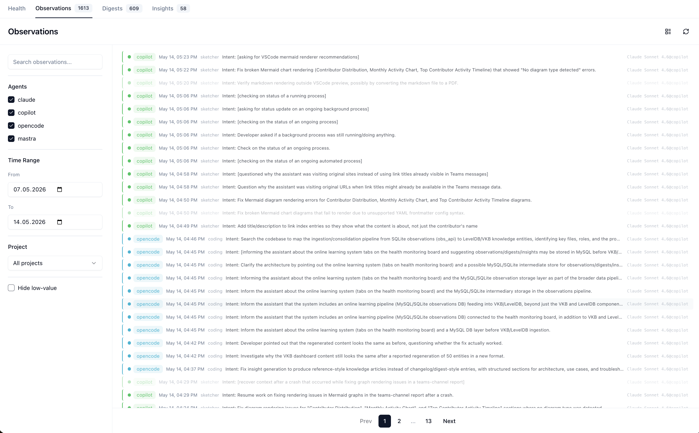

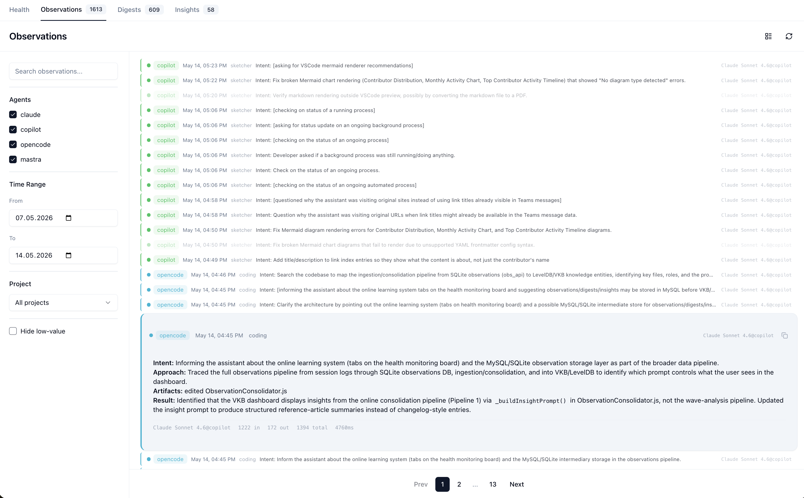

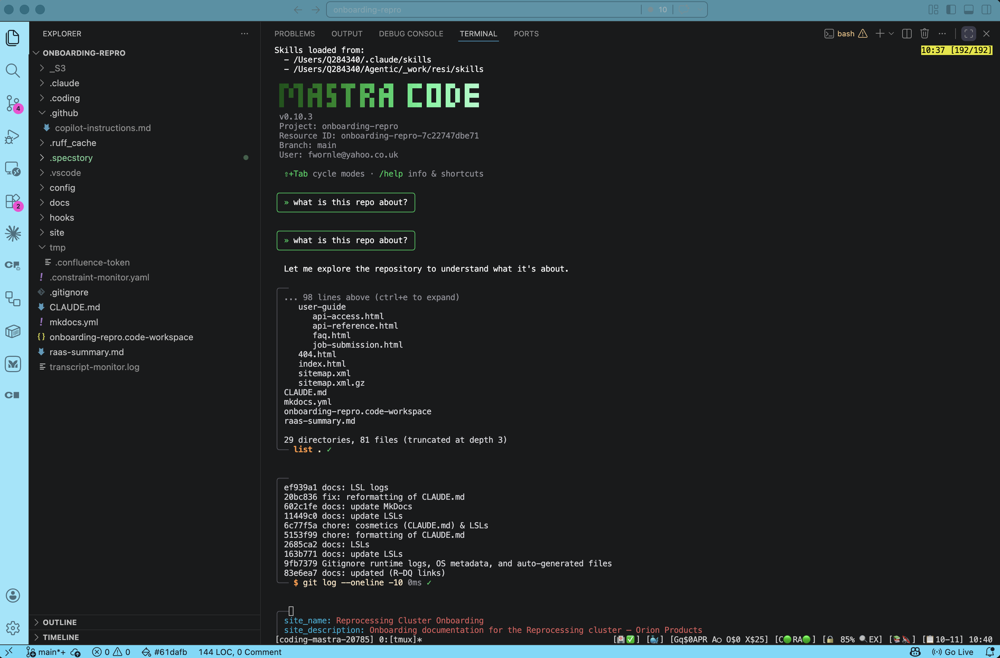

##### Digests & Insights — Project-Root Scoped Consolidation

Observations are consolidated in two LLM-driven stages, both **strictly scoped to a single codebase**:

| Stage | Cadence | Output |
|-------|---------|--------|
| **Digest** | Daily | Thematic grouping of that day's observations into narrative summaries |
| **Insight** | On demand / cron | Persistent reference articles synthesized from unsynthesized digests |

**Partition key — `projectRoot`**: every observation records the absolute path of its codebase (e.g. `~/Ritwik/Memory/agent_agnostic/obs-memory`). The consolidator normalises this to a `~/…` key so observations from the same codebase always converge, regardless of whether they were captured with a full or redacted path. Two codebases that share a basename (e.g. two forks both called `obs-memory`) are kept separate.

**Root derivation** (for observations without an explicit `projectRoot`):
1. Extract from `metadata.projectRoot` captured at ingestion.
2. Derive from `modifiedFiles`/`readFiles` paths matched against the local repo corpus.
3. Fall back to the basename label as a provisional key.
4. Unresolvable rows go to an isolated `unknown` bucket — never merged with any real root.

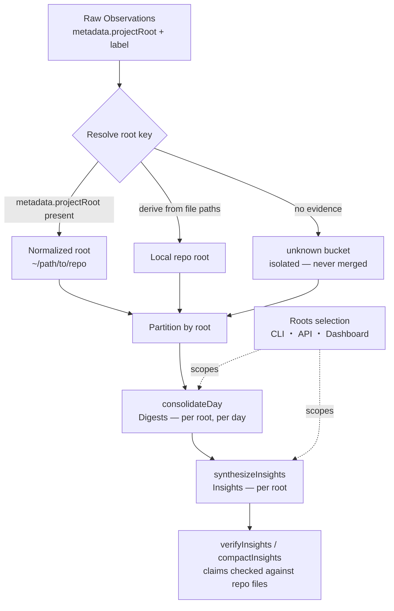

**Selecting which root(s) to run:**

```bash
# CLI
node scripts/consolidate-observations.js --list-roots
node scripts/consolidate-observations.js --roots=~/path/to/repo
node scripts/consolidate-observations.js --root=~/repoA --root=~/repoB

# REST API
curl http://localhost:12436/api/project-roots
curl -X POST http://localhost:12436/api/consolidation/run \
  -H 'Content-Type: application/json' \
  -d '{"roots":["~/path/to/repo"]}'
```

The **Insights page** (`http://localhost:3032/insights`) includes a project-root multi-select so you can trigger a scoped consolidation run and view/filter insights by codebase directly from the dashboard.

**Truthfulness & Confidence**: after synthesis each insight's backticked code/path claims are verified against the codebase files. `verificationRatio` (verified / total claims), `confidence` (LLM-assigned, decays over time), and `fresh`/`partial`/`stale` bands are surfaced in the Coverage tab.

See [Consolidation & Project-Root Scoping](docs/observations/README.md#consolidation--project-root-scoping) for full details.

### Integration Components

- **[System Health Dashboard](integrations/system-health-dashboard/)** - Real-time health visualization
- **[MCP Constraint Monitor](integrations/mcp-constraint-monitor/)** - PreToolUse hook enforcement
- **[MCP Semantic Analysis](integrations/mcp-semantic-analysis/)** - 11-agent AI analysis system
- **[VKB Visualizer](integrations/vkb-visualizer/)** - Knowledge graph visualization
- **[All Integrations](integrations/)** - Complete integration list

### Skills & Commands

#### [Skills System](docs/skills-system.md)
Reusable workflow instructions shared across all agents — drop a `.md` into `.claude/commands/` and it propagates to Claude, Copilot, and OpenCode automatically.

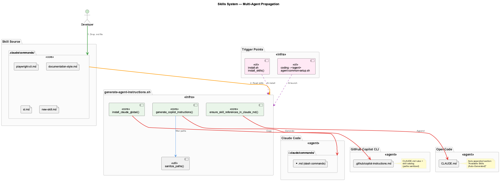

### Getting Started

- **[Installation & Setup](docs/getting-started.md)** - Complete installation guide
- **[Provider Configuration](docs/provider-configuration.md)** - LLM provider setup
- **[Troubleshooting](docs/troubleshooting.md)** - Common issues and solutions

---

## 🔧 Core Features

### Live Session Logging (LSL)

Real-time conversation classification and routing with enterprise-grade security:

- **3-Layer Classification**: Path analysis → Keyword matching → Semantic analysis
- **98.3% Security Effectiveness**: Enhanced redaction with bypass protection
- **Multi-User Support**: Secure user isolation with SHA-256 hash generation
- **Zero Data Loss**: Every exchange properly classified and preserved
- **200x Performance**: Optimized bulk processing with sub-millisecond tracking

**Status**: ✅ Production Ready

### Constraint Monitoring

PreToolUse hook integration for real-time code quality enforcement:

- **18 Active Constraints**: Security, architecture, code quality, PlantUML, documentation
- **Severity-Based**: CRITICAL/ERROR blocks, WARNING/INFO allows with feedback
- **Dashboard Monitoring**: Live violation feed (port 3030)
- **REST API**: Programmatic access (port 3031)
- **Testing Framework**: Automated and interactive constraint testing

**Status**: ✅ Production Ready

### Knowledge Management

Capture, organize, and visualize development insights with git-based team collaboration:

- **UKB (Update Knowledge Base)**: Auto git analysis + interactive capture
- **VKB (Visualize Knowledge Base)**: Web-based graph visualization
- **Graph Database**: Agent-agnostic persistent storage (Graphology + Level)
- **Git-Tracked JSON**: Team collaboration via pretty JSON exports
- **graph-sync CLI**: Manual export/import/status operations
- **Auto-Sync**: Import on startup, export on changes (5s debounce)
- **Team Isolation**: Multi-team support with conflict resolution
- **Domain-Specific**: Automatic domain knowledge bases per team

**Status**: ✅ Production Ready

### Multi-Agent Semantic Analysis

11 specialized agents for comprehensive code analysis:

1. **CoordinatorAgent** - Workflow orchestration
2. **GitHistoryAgent** - Git commits and architectural decisions
3. **VibeHistoryAgent** - Conversation file processing
4. **SemanticAnalysisAgent** - Deep code analysis (uses LLM)
5. **WebSearchAgent** - External pattern research
6. **InsightGenerationAgent** - Insight generation with PlantUML (uses LLM)
7. **ObservationGenerationAgent** - Structured UKB-compatible observations
8. **QualityAssuranceAgent** - Output validation with auto-correction (uses LLM)
9. **ContentValidationAgent** - Stale entity detection and knowledge refresh
10. **PersistenceAgent** - Knowledge base persistence
11. **DeduplicationAgent** - Semantic duplicate detection

**Debug Mode**: Full debugging support with single-step execution, substep inspection, and mock LLM mode for cost-free testing. See [UKB Workflow System](docs/health-system/ukb-workflow-system.md).

**Status**: ✅ Production Ready

### Live Memory Context Preview

See the **Working** and **Observational** memory that would be retrieved for the prompt
you are *typing* in the CLI — **before** you press Enter. Because the prompt has not
been submitted yet, no `UserPromptSubmit`-style hook has fired; the draft only exists on
screen. A host-side monitor reads it straight from the terminal via `tmux capture-pane`,
so the mechanism is fully **agent-agnostic** and works for **GitHub Copilot CLI**,
**Claude Code**, and **OpenCode** without any CLI-specific plugin.

How it works:

- **Capture** — every coding agent runs inside the shared tmux wrapper. `scripts/live-query-monitor.js` polls the pane (`tmux capture-pane -p`) and extracts the current input-box draft with [`InputDraftExtractor`](src/live-logging/InputDraftExtractor.js) (structure-first parsing of the box border + prompt marker; placeholders and UI noise are filtered out).
- **Draft stream** — on every change, the draft is POSTed to `/api/live-context/draft` and streamed straight into the **main heading bar**, so you see the prompt update live as you type.
- **Debounce + retrieve** — once the draft is *stable* (unchanged for **3 s**) and new, it is passed through the Knowledge Context Injection memory pipeline (`/api/retrieve` → `RetrievalService`), which returns **Working Memory (≤300 tokens)** and **Observational memory (≤700 tokens)** for the live query.
- **Ranked candidates** — the same response also carries `rankedResults`, the full pre-token-budget Observational Memory candidate list in final ranked order, so dashboard views can inspect every match even when the rendered markdown is truncated.
- **Human rerank capture** — the **All Results** sidebar lets a user move candidates up/down, then save the human order. The dashboard forwards the event to the host Observations API, which embeds the query and stores compact rank-delta signals in Qdrant collection `human_rerank_feedback`. These signals close a **learned rerank loop**: similar future queries automatically promote the items humans preferred (see *Learned rerank boost* below).
- **Submitted log** — when you press Enter (the input box clears), the sent query is POSTed to `/api/live-context/submitted` and appended to the **Recent Queries** log on the left — a history of prompts actually submitted to the CLI.
- **Display** — the **Live Context** tab renders four zones in real time over a dedicated WebSocket: the heading bar (live typing), the Recent Queries log (submitted prompts), the Working | Observational memory columns, and an **All Results** sidebar listing every ranked candidate with tier and score.

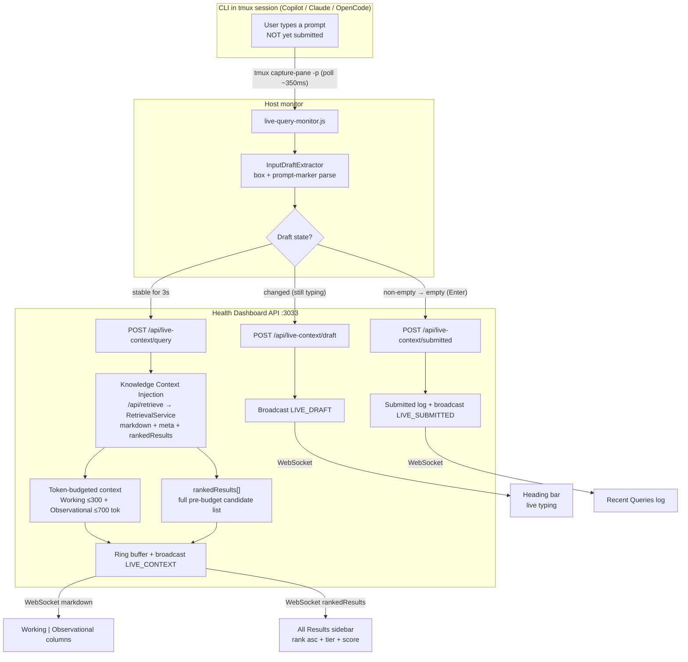

Human rerank capture flow:

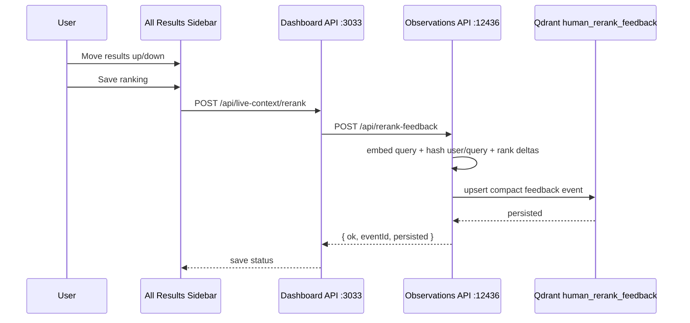

#### Learned rerank boost (closed feedback loop)

Captured re-rankings are not just stored — for **future similar queries** they
become a bounded, fail-open ranking signal. During retrieval, `RetrievalService`
embeds the query, finds cosine-similar prior feedback events in
`human_rerank_feedback` (top-K 10, threshold 0.85), and converts their per-item
rank deltas into a clamped multiplier on `rrfScore` so human-promoted items rank
higher. The boost is applied **after** freshness rerank and **before** the final
sort, affecting both `rankedResults` and the token-budgeted markdown. It is a
strict no-op whenever the feedback store is empty or unavailable, so cold-start
behavior is identical to today.

The multiplier is `clamp(1 + 0.30 × learnedSignal, 0.90, 1.25)` where
`learnedSignal` blends each event's cosine similarity, exponential age decay
(45-day half-life), project scope, and the normalized rank delta. Boosted items
carry an optional `learnedRerank` `{ multiplier, signal, matchedEvents }` field
for explainability. Tunables live as env-overridable constants at the top of
[`src/retrieval/feedback-store.js`](src/retrieval/feedback-store.js)
(`LEARNED_RERANK_THRESHOLD`, `LEARNED_RERANK_TOPK`,
`LEARNED_RERANK_HALF_LIFE_DAYS`, `LEARNED_RERANK_COEFFICIENT`,
`LEARNED_RERANK_MIN/MAX_MULTIPLIER`, `LEARNED_RERANK_GLOBAL`).

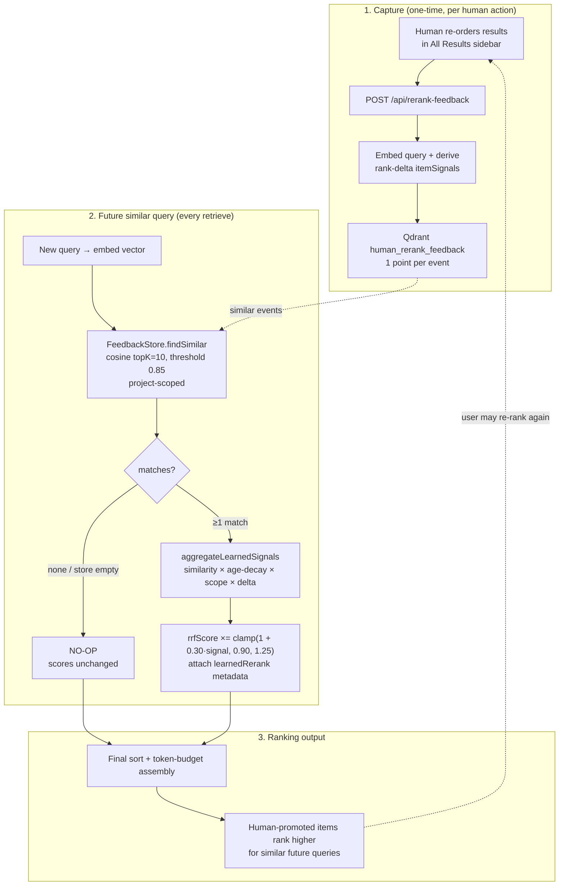


Configuration: enabled per agent via `AGENT_ENABLE_LIVE_CONTEXT=true` (default) in
`config/agents/*.sh`. Tunables (env): `LQM_POLL_MS`, `LQM_STABLE_MS`,
`LQM_MIN_INTERVAL_MS`, `LQM_BUDGET`, and `LQM_INPUT_MARKERS` (override prompt markers
for a CLI whose chrome changed). The feature is fail-open end to end — if the monitor,
dashboard, or retrieval service is unavailable, the CLI is never affected.

**Requirement — the CLI must run inside tmux.** Capture works by reading the agent's
tmux pane, so the draft is only visible when the agent is launched through the shared
tmux wrapper. Launch any agent with `coding --copilot`, `coding --claude`, or
`coding --opencode` and the monitor starts automatically. A CLI started **directly**
(e.g. running `copilot` outside `coding`, with no tmux session) cannot be captured — it
has no pane to read, so the **Live Context** tab will stay empty for that session even
though it shows *Live* (connected). Open the dashboard at
[http://localhost:3032](http://localhost:3032) → **Live Context**.

To enable Live Context for a tmux session that is **already running** (one that predates
the feature, or where it was disabled), attach the monitor on demand:

```bash
# Auto-detect the current ($TMUX) or single coding-* session, infer the agent:
scripts/live-context-attach.sh

# Or target a specific session explicitly:
scripts/live-context-attach.sh coding-copilot-12345 copilot
```

The monitor self-exits when its tmux session closes; re-running the helper for an
already-monitored session is a no-op.

**Status**: ✅ Production Ready

## ⚡ Usage Examples

### Knowledge Management

```bash
# Start visualization server
vkb

# View at http://localhost:8080

# Manual sync operations
graph-sync status      # View sync status
graph-sync export      # Export all teams to JSON
graph-sync import      # Import all teams from JSON
graph-sync sync        # Full bidirectional sync
```

### Constraint Monitoring

```bash
# Start dashboard (automatic with install)
cd integrations/mcp-constraint-monitor
npm run dashboard  # http://localhost:3030

# API access
curl http://localhost:3031/api/status
curl http://localhost:3031/api/violations
```

### Live Session Logging

```bash
# Automatic during Claude Code sessions
# Session files in .specstory/history/

# Status line shows:
📋🟠2130-2230(3min) →coding
# 📋 = logging, 🟠 = window closing, →coding = activity detected
```

### Semantic Analysis Workflows

**Claude Code:**
```
# Repository analysis workflow
start_workflow {
  "workflowType": "repository-analysis",
  "parameters": {
    "repository": ".",
    "depth": 25,
    "significanceThreshold": 6
  }
}
```

**VSCode CoPilot:**
```bash
# Via HTTP API
curl -X POST http://localhost:8765/api/semantic/analyze-repository \
  -H "Content-Type: application/json" \
  -d '{"repository": ".", "depth": 25}'
```

### Digests & Insights (Observational Memory)

```bash
# List codebases with observations
node scripts/consolidate-observations.js --list-roots

# Consolidate one codebase (digests + insights + verification)
node scripts/consolidate-observations.js --roots=~/path/to/repo

# Insights only for a specific root
node scripts/consolidate-observations.js --insights --roots=~/path/to/repo

# Via the Observations API
curl http://localhost:12436/api/project-roots
curl -X POST http://localhost:12436/api/consolidation/run \
  -H 'Content-Type: application/json' \
  -d '{"roots":["~/path/to/repo"]}'

# Dashboard: http://localhost:3032/insights
#   → use the project-root multi-select to scope and trigger runs
```

---

## 🛠️ Configuration

### Quick Configuration

```bash
# Set API keys
export ANTHROPIC_API_KEY="your-key-here"
export OPENAI_API_KEY="optional-fallback"

# Configure preferred agent
export CODING_AGENT="claude"  # or "copilot"
```

### Detailed Configuration

See [Getting Started](docs/getting-started.md) for:
- API key setup
- MCP configuration
- Network setup (proxies/firewalls)
- Verification steps

---

## 📊 System Status

### Quick Health Check

```bash
# Test all components (check-only mode - safe, no modifications)
./scripts/test-coding.sh

# Interactive mode - prompts before each repair
./scripts/test-coding.sh --interactive

# Auto-repair mode - fixes coding-internal issues only
./scripts/test-coding.sh --auto-repair

# Check MCP servers
cd integrations/mcp-server-semantic-analysis && npm test

# Check constraint monitor
cd integrations/mcp-constraint-monitor && npm test
```

**Note**: The test script defaults to `--check-only` mode and will NEVER auto-install system packages.

### Current Status

✅ **Health System** - 4-layer monitoring with auto-healing
✅ **Live Session Logging** - Real-time classification with 98.3% security
✅ **Constraint Monitoring** - 18 active constraints with PreToolUse hooks
✅ **Knowledge Management** - UKB/VKB with MCP integration
✅ **Multi-Agent Analysis** - 11 agents with workflow orchestration
✅ **Observational Memory** - Per-exchange LLM observations with dashboard
✅ **Status Line System** - Real-time indicators via unified tmux status bar
✅ **Cross-Platform** - macOS, Linux, Windows support

---

## 🤝 Contributing

This is a personal development toolkit. For issues or suggestions:

1. Check [Troubleshooting](docs/troubleshooting.md)
2. Review [Architecture Documentation](docs/architecture/README.md)
3. Create an issue with detailed information

---

## 📄 License

This project is licensed under the MIT License - see the [LICENSE](LICENSE) file for details.

Copyright © 2025 Frank Wornle

---

## 🔗 Quick Links

- **Documentation Hub**: [docs/README.md](docs/README.md)
- **Installation Guide**: [docs/getting-started.md](docs/getting-started.md)
- **LLM Providers & Local Models**: [docs/provider-configuration.md](docs/provider-configuration.md)
- **Agent Abstraction API**: [docs/architecture/agent-abstraction-api.md](docs/architecture/agent-abstraction-api.md)
- **Observational Memory**: [docs-content/core-systems/observational-memory.md](docs-content/core-systems/observational-memory.md)
- **Digests & Insights Scoping**: [docs/observations/README.md](docs/observations/README.md#consolidation--project-root-scoping)
- **Skills System**: [docs/skills-system.md](docs/skills-system.md)
- **Adding Agents**: [docs/agent-integration-guide.md](docs/agent-integration-guide.md)
- **Docker Architecture**: [docs/architecture-report.md](docs/architecture-report.md)
- **Docker Deployment**: [docker/README.md](docker/README.md)
- **System Overview**: [docs/system-overview.md](docs/system-overview.md)
- **Core Systems**: [docs/core-systems/](docs/core-systems/)
- **Integrations**: [docs/integrations/](docs/integrations/)
- **Knowledge Management**: [docs/knowledge-management/](docs/knowledge-management/)
