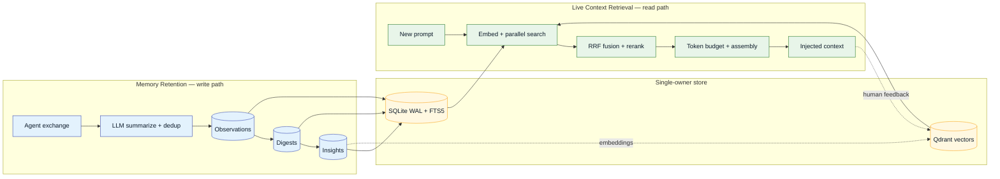

# 👁️ Observational Memory

> A cross-agent, self-improving memory system that **watches** your coding sessions,
> **summarizes** them into structured knowledge, and **retrieves** the right slice of that
> knowledge back into your next prompt — continuously sharpened by **live human feedback**.

This documentation is a focused deep-dive into the **Observational Memory** retention and retrieval
machinery (plus **Working Memory**). It covers
**only** the components tied to memory retention and retrieval — for the surrounding platform (LSL,
UKB/VKB, constraints, health monitoring) refer back to the base project.

## What sets it apart

Most "AI memory" systems are a single loop: embed text → store vectors → cosine search → inject
top-k. Observational Memory adds three structural advantages:

| Capability | Vanilla memory | Observational Memory |
|------------|----------------|----------------------|
| **Knowledge shape** | Flat chunks | 3-tier hierarchy: Observations → Digests → Insights |
| **Retrieval** | Single vector search | Hybrid: semantic **+** keyword (FTS5) **+** recency, fused with RRF |
| **Ranking signals** | Cosine only | Tier weight, agent profile, context, topic overlap, freshness, query↔item emphasis |
| **Human in the loop** | None | **Live drag-to-reorder feedback** becomes a learned, decaying rerank boost |
| **Truth maintenance** | Stale silently | Insights are re-verified against live code; stale claims demoted |

## The three tabs

- :material-database-import: **[Memory Retention](memory-pipeline/memory-retention.md)**

    The write path — capture, summarize, dedup, store, consolidate, and truthfulness-verify. Plus
    **Working Memory**, the always-on ≤ 300-token context prefix.

- :material-magnify-scan: **[Live Context Retrieval](memory-pipeline/live-context-retrieval.md)**

    The read path — the 8-stage pipeline: embed, parallel search, RRF fusion, tier weights,
    reranking passes, token budgeting, and the live context preview.

- :material-account-arrow-up: **[Human-in-the-Loop](memory-pipeline/human-in-the-loop.md)**

    The full reranking mechanism — capture & apply, the two similarity gates with the exponential
    emphasis curve, a worked example, safety guarantees, the self-improving loop, and the dashboard
    tuning controls.

## The two pipelines in one picture

---

*Part of the [Agent-Agnostic Observational Memory](https://github.com/ritwik-ghosh09/Agent-Agnostic-Observational-Memory) project.*
