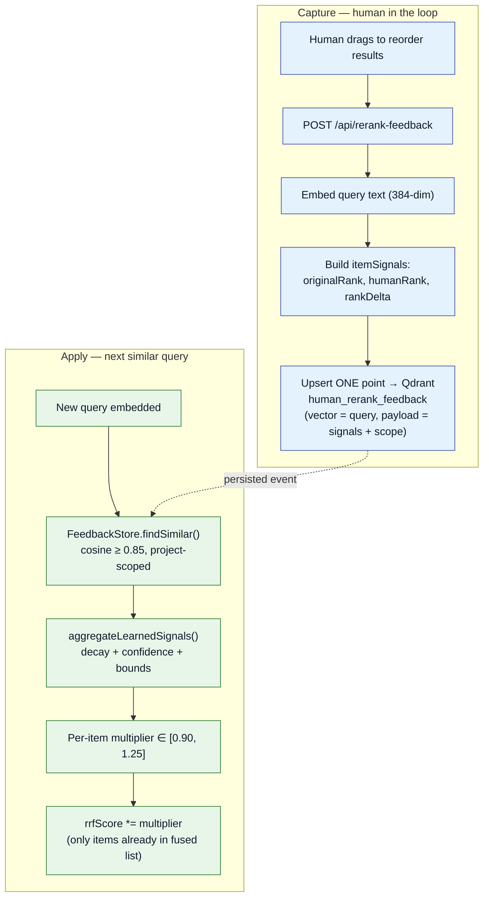
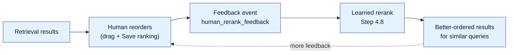
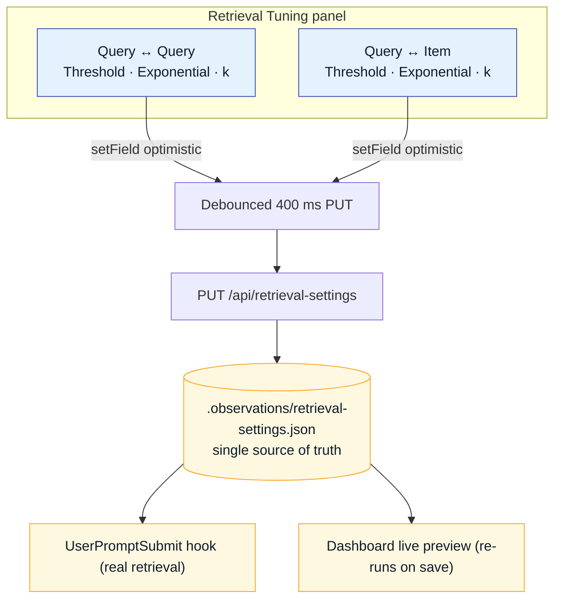

# Human-in-the-Loop

This is the capability that elevates Observational Memory above a vanilla retrieval pipeline.
**A human can reorder retrieval results to reflect what was actually useful, and the system learns
from that judgment** — applying a bounded, decaying, confidence-weighted boost to similar future
queries.

It implements the approved design *"Feedback Loop Design: Human Re-Ranking as a Learned Path-A
Boost"*, and runs as Step 4.8 of the [Live Context Retrieval](live-context-retrieval.md#48-learned-rerank)
read path. Two phases: **capture** and **apply**.



## Capture — turning a reorder into a learning signal

When a human reorders results in the dashboard live-context view, the client sends the query plus
the before/after ordering to `POST /api/rerank-feedback`. The obs-api:

1. Embeds the **query text** (must be 384-dim).
2. Builds one `itemSignals` entry per item, capturing its stable `itemKey` (`tier:id`),
   `originalRank`, the human-chosen `humanRank`, and the `rankDelta = originalRank − humanRank`.
3. **Upserts a single Qdrant point** into `human_rerank_feedback` — vector = the query embedding,
   payload = the item signals plus scope context (`project`, `agent`, `cwd`, `sessionId`,
   `userHash`, `capturedAt`, `schemaVersion`).

One human save = one compact, query-keyed event. A `GET /api/rerank-feedback` endpoint provides an
audit view (vectors omitted).

## Apply — the learned boost at query time

On the next retrieval, `_applyLearnedRerank` (Step 4.8) consults the feedback store.
`FeedbackStore.findSimilar` searches `human_rerank_feedback` for events whose stored **query
embedding** is cosine-similar to the current query (default threshold 0.85), **project-scoped
first**, with an optional reduced-weight global fallback only when project matches are sparse.

Matched events are aggregated by the **pure, deterministic, time-injectable**
`aggregateLearnedSignals()` (no I/O — unit-testable without Qdrant):

```text
similarityWeight = exponentialEnabled ? clamp(score, 0, 1) ^ exponent : score
ageWeight        = 0.5 ^ (ageDays / HALF_LIFE_DAYS)        // default half-life 45 days
eventWeight      = similarityWeight × ageWeight × scopeWeight × userWeight
deltaNorm        = clamp((originalRank − humanRank) / max(windowSize − 1, 1), −1, 1)
weightedDelta    = Σ(deltaNorm × eventWeight) / max(Σ eventWeight, ε)
confidence       = min(1, Σ|eventWeight| / CONFIDENCE_DIVISOR)   // divisor default 1.5
learnedSignal    = clamp(weightedDelta × confidence, −1, 1)
multiplier       = clamp(1 + COEFFICIENT × learnedSignal, MIN, MAX)  // 0.30, [0.90, 1.25]
```

The multiplier is applied as `item.rrfScore *= multiplier` — but **only** to items already present
in the fused candidate list (missing-candidate recall is deliberately out of scope). Each boosted
item carries a `learnedRerank` `{ multiplier, signal, matchedEvents }` object for explainability,
surfaced as a dashboard pill.

## The two gates that decide how much a reorder counts

Not every past reorder should influence the current query equally. A reorder you made for *"why does
the docker build time out"* should strongly shape a near-identical future query, but should barely
touch *"how does RRF fusion work"*. Two gates, applied in sequence inside
`aggregateLearnedSignals()`, enforce exactly that.

**Gate 1 — the similarity admission gate (hard cutoff).**
`FeedbackStore.findSimilar` only returns feedback events whose stored query embedding has cosine
similarity **≥ the `queryQuery` threshold** (default `0.85`) to the current query, via Qdrant's
`score_threshold`. Anything below the floor is never even considered — a binary in/out decision.
This keeps unrelated past opinions out of the picture entirely.

**Gate 2 — the exponential emphasis gate (soft reshape).**
Admission is not enough, because the admitted band (`0.85 → 1.00`) still mixes "basically the same
question" with "loosely related". MiniLM cosine scores are compressed: a *near-duplicate* query
might score `0.97` while a *merely related* one scores `0.86`, only `0.11` apart. A linear weight
(`weight = similarity`) would treat those almost identically. The exponential reshape

```text
similarityWeight = clamp(similarity, 0, 1) ^ k        // k = queryQuery exponent, default 3
```

**stretches** that compressed band so small similarity differences become large weight differences —
letting the system make a *fine-grained* selection among very-similar queries.


Reading the plot (x = query↔query cosine similarity, y = the weight that feedback event receives):

- **`k = 1` (linear, exponential OFF)** — weight equals raw cosine. At the `0.85` floor an admitted
  event still carries `0.85` weight, so a barely-related past query counts almost as much as a
  perfect match. Coarse.
- **`k = 3` (default)** — the curve bows downward: `0.86` collapses to `0.86³ ≈ 0.64`, while `0.97`
  stays high at `0.97³ ≈ 0.91`. The gap between "related" and "near-duplicate" widens from `0.11` to
  `~0.27`.
- **`k = 5` / `k = 8`** — progressively sharper. At `k = 8`, `0.86⁸ ≈ 0.30` is heavily suppressed
  while `0.99⁸ ≈ 0.92` survives — only near-identical queries retain meaningful weight.

**Why this matters for fine-grained selection.** Within the narrow, high-similarity band that
survives Gate 1, the *ordering* of influence is what determines whether the boost reflects the
*right* prior judgment. The exponential turns a flat, indiscriminate band into a steep ramp, so the
event from the query that truly matches dominates the events from queries that merely overlap.
Raising `k` tightens this to near-duplicate-only; lowering it broadens generalization.

The same two-gate idea is reused on the read path as **Query↔Item** emphasis
([Step 4.75](live-context-retrieval.md#475-queryitem-emphasis-optional)): Gate 1 is the `queryItem`
admission threshold (which *items* are retrieved), Gate 2 is `cosine^k` applied to each item's score
(how steeply near-duplicate *items* are emphasized).

## Worked example — from a drag to a boost

Suppose last week you searched **"docker build times out on coding-services"** and dragged the
insight *"ETM Docker Build Timeout Hardening"* from rank 5 up to rank 1, out of 8 shown results.
That created one feedback event. Today a teammate asks **"docker-compose build hangs for
coding-services"** — cosine similarity to your stored query is `0.95`. With defaults (`k = 3`,
half-life `45 d`, coefficient `0.30`, confidence divisor `1.5`), and the event captured `10` days
ago:

```text
similarityWeight = 0.95 ^ 3                     = 0.857     (Gate 2 reshape)
ageWeight        = 0.5 ^ (10 / 45)              = 0.857     (45-day decay)
eventWeight      = 0.857 × 0.857 × 1.0 × 1.0    = 0.735     (scope/user weight = 1.0)
deltaNorm        = (5 − 1) / (8 − 1)            = 0.571     (promoted 4 ranks of 7)
weightedDelta    = (0.571 × 0.735) / 0.735      = 0.571     (single event)
confidence       = min(1, 0.735 / 1.5)          = 0.490     (one event ⇒ modest)
learnedSignal    = clamp(0.571 × 0.490, −1, 1)  = 0.280
multiplier       = clamp(1 + 0.30 × 0.280, 0.90, 1.25) = 1.084
```

The insight's `rrfScore` is boosted **≈ 8.4 %** — enough to lift it a rank or two, not enough to
override a strongly off-topic result. Now contrast the gates and the loop's self-reinforcement:

| Scenario | Effect on multiplier |
|----------|----------------------|
| Similarity only `0.86` (just above floor), `k = 3` | `0.86³ = 0.64` weight → `confidence ≈ 0.36` → multiplier `≈ 1.062` (smaller) |
| Same `0.86` but exponential **OFF** (linear) | weight `0.86` → larger, indiscriminate boost — the coarse behavior the exponential prevents |
| **Five** teammates agree (5 similar events) | `Σ\|eventWeight\|` grows → `confidence → 1.0` → multiplier approaches the `1.25` cap |
| Event is now `90` days old | `ageWeight = 0.5^(90/45) = 0.25` → boost shrinks ~4× as the opinion ages out |

This is the crux of the feature: **a single human drag becomes a small, principled, decaying nudge;
repeated human agreement on similar queries compounds into a strong, bounded boost** — and the
exponential gate guarantees that compounding only happens for the queries that genuinely match.

## Why this is safe — design guarantees

| Guarantee | How |
|-----------|-----|
| **Fail-open** | Any Qdrant error, missing collection, or zero matches → `[]` and a no-op multiplier of 1.0. Learned rerank can never degrade baseline retrieval. |
| **Bounded** | Multiplier hard-clamped to `[0.90, 1.25]` — always weaker than context/topic signals, so feedback nudges rather than dominates. |
| **Decaying** | Exponential 45-day half-life: stale opinions fade automatically. |
| **Confidence-weighted** | A single weak event barely moves the score; agreement across many strong, recent, similar events is required for a full boost. |
| **Query-similarity-gated** | The `score^exponent` reshape concentrates influence on near-duplicate queries; loosely-similar past queries contribute little. |
| **Scoped** | Project-scoped by default; global fallback is off unless explicitly enabled and runs at higher threshold + reduced weight. |
| **Explainable** | `learnedRerank` metadata records exactly why an item was boosted. |

## The self-improving loop



Over time, the system's ranking converges toward **human-validated usefulness** for the queries that
matter most — something pure embedding similarity cannot do.

## Retrieval tuning controls

The dashboard exposes the two similarity stages as live, draggable controls in the **Retrieval
Tuning** panel (`RetrievalTuningPanel.tsx`). These are not per-session toys — they write to the same
`.observations/retrieval-settings.json` that the production retrieval path reads, so **whatever you
set here is the single source of truth** for both the `UserPromptSubmit` knowledge-injection hook
and the dashboard's live preview.



### The two control groups

| Group | Governs | Stage | Default |
|-------|---------|-------|---------|
| **Query ↔ Query** | How strongly a *past human-ranked query* influences the current ranking (the learned-rerank feedback gate) | Step 4.8 (this page) | threshold `0.85`, exponential **on**, `k = 3.0` |
| **Query ↔ Item** | Which *memory items* are admitted for the current query, and how steeply their similarity is emphasized | [Steps 2 + 4.75](live-context-retrieval.md#475-queryitem-emphasis-optional) | threshold `0.70`, exponential **off**, `k = 3.0` |

### The three knobs in each group

| Control | UI | Range / step | Effect |
|---------|-----|--------------|--------|
| **Threshold** | Slider | `0.50 – 0.99`, step `0.01` | The cosine **admission floor** (Gate 1). Raise → fewer, stricter matches (precision ↑, recall ↓). Lower → more, looser matches (recall ↑, noise ↑). |
| **Exponential** | Switch | on / off | Turns Gate 2 on/off. **On** → `weight = similarity^k`. **Off** → linear/raw cosine. |
| **Exponent (k)** | Slider | `1.0 – 8.0`, step `0.5` | Sharpness of the falloff (disabled, shown `—`, when the switch is off). Higher `k` → only near-duplicate queries/items keep weight (see the curve above); lower `k` → broader generalization. |

### How a change propagates

1. You drag a slider or flip a switch → local state updates **optimistically** (instant UI feedback).
2. The change is **debounced 400 ms**, then `PUT /api/retrieval-settings` persists it.
3. The server **validates and clamps** to bounds (threshold `[0.5, 0.99]`, exponent `[1.0, 8.0]`),
   writes atomically (tmp file + rename), and returns the stored value.
4. The dashboard's `onSaved` callback **re-runs the live preview**, so you immediately see how the
   new settings reorder a real query's results.
5. The very next agent prompt picks up the same file (mtime-cached, fail-open to defaults on any
   read error) — no restart required.

### Practical tuning recipes

| Goal | Adjustment |
|------|-----------|
| Feedback is over-generalizing to loosely-related queries | **Query↔Query:** raise threshold toward `0.90` and/or raise `k` to `5–8` |
| Feedback barely affects anything | **Query↔Query:** lower threshold toward `0.80`, keep exponential on at `k ≈ 3` |
| Too few memories retrieved | **Query↔Item:** lower threshold toward `0.60` |
| Retrieved items feel off-topic | **Query↔Item:** turn exponential **on**, `k ≈ 3` to emphasize true near-duplicates |

## Tuning constants

[`feedback-store.js`](https://github.com/ritwik-ghosh09/Agent-Agnostic-Observational-Memory/blob/main/src/retrieval/feedback-store.js),
all env-overridable:

| Constant | Default | Meaning |
|----------|---------|---------|
| `LEARNED_RERANK_THRESHOLD` | 0.85 | Query↔query similarity floor (Gate 1) |
| `LEARNED_RERANK_TOPK` | 10 | Max feedback events per query |
| `LEARNED_RERANK_HALF_LIFE_DAYS` | 45 | Age decay half-life |
| `LEARNED_RERANK_COEFFICIENT` | 0.30 | Boost coefficient |
| `LEARNED_RERANK_MIN_MULTIPLIER` / `MAX_MULTIPLIER` | 0.90 / 1.25 | Hard multiplier bounds |
| `LEARNED_RERANK_CONFIDENCE_DIVISOR` | 1.5 | Confidence normalizer |
| `LEARNED_RERANK_SIMILARITY_EXPONENT` | 3.0 | Gate 2 reshape (k) |
| `LEARNED_RERANK_EXPONENTIAL_ENABLED` | true | Enable Gate 2 |
| `LEARNED_RERANK_GLOBAL` | off | Enable reduced-weight cross-project fallback |

---

*Back to [Memory Retention](memory-retention.md) · [Live Context Retrieval](live-context-retrieval.md) · the [repository](https://github.com/ritwik-ghosh09/Agent-Agnostic-Observational-Memory).*
