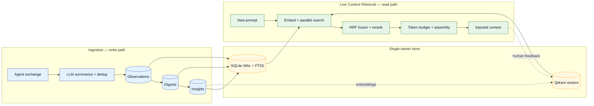
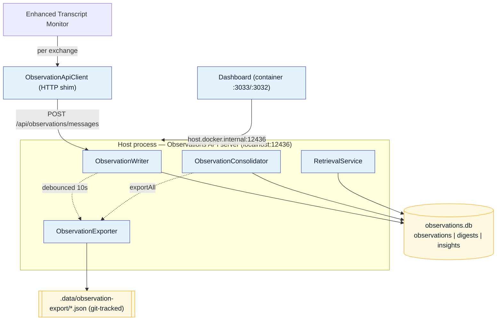

# Memory Pipeline — Overview

!!! abstract "An extension of the Coding Documentation"
    This section is a focused deep-dive built **on top of** the base
    [Coding Documentation :material-book-open-variant:](https://fwornle.github.io/coding/).
    It documents the **Observational Memory + Working Memory ingestion** pipeline and the
    **Live Context Retrieval** pipeline (with its full ranking machinery) as implemented in the
    [`Agent-Agnostic-Observational-Memory`](https://bmw.ghe.com/Ritwik-GA-Ghosh/Agent-Agnostic-Observational-Memory)
    repository. For the surrounding platform (LSL, UKB/VKB, constraints, health monitoring) refer back to the
    [base project](https://fwornle.github.io/coding/).

## The two pipelines in one picture

The system has two complementary halves that share a single store:

- **Ingestion (write path)** — every completed agent exchange is summarized, deduplicated, and
  persisted; later consolidated into daily **digests** and durable **insights**.
- **Live Context Retrieval (read path)** — on each new prompt, the most relevant memory is
  retrieved, fused, re-ranked, budgeted, and injected back into the agent's context.

## Three-tier memory hierarchy

Inspired by Mastra's Observer/Reflector hierarchy, adapted for cross-agent project knowledge:

| Tier | What | Trigger | Volume |
|------|------|---------|--------|
| **Observations** | Per-exchange structured summaries (Intent / Approach / Artifacts / Result) | Real-time, per prompt-set | ~30/day |
| **Digests** | Daily thematic work-session summaries | End of day (cron or manual) | ~7/day |
| **Insights** | Persistent, self-verifying project knowledge | Weekly or ≥ 5 new digests | ~10 total |

## Single-owner architecture

The runtime DB has exactly **one owner**: a host process — the **Observations API server**
([`scripts/observations-api-server.mjs`](https://bmw.ghe.com/Ritwik-GA-Ghosh/Agent-Agnostic-Observational-Memory/blob/main/scripts/observations-api-server.mjs), port `12436`).
Every other consumer (transcript monitor, dashboard, consolidator, retrieval) reaches
`observations.db` **only** through this HTTP service. The `.observations` directory is **not**
bind-mounted into the container.

This eliminates the classic SQLite-on-Docker-Desktop WAL/SHM corruption pattern where a host
writer and a container reader lose coherence across the bind-mount boundary. The pattern mirrors
the UKB/VKB "one writer, everyone else over HTTP" approach.

## Where to go next

- :material-database-import: **[Ingestion](ingestion.md)** — capture, summarize, dedup, consolidate, verify.
- :material-lightning-bolt: **[Working Memory](working-memory.md)** — the always-on ≤300-token context prefix.
- :material-magnify-scan: **[Live Context Retrieval](retrieval.md)** — the 8-stage read pipeline.
- :material-sort-variant: **[Ranking & Nuances](ranking.md)** — RRF, tier weights, reranking, learned feedback.
- :material-view-dashboard: **[Live Context Preview](live-context.md)** — the dashboard tuning surface.

---

*Part of the [Agent-Agnostic Observational Memory](https://bmw.ghe.com/Ritwik-GA-Ghosh/Agent-Agnostic-Observational-Memory) project — an extension of the [Coding Documentation](https://fwornle.github.io/coding/).*
