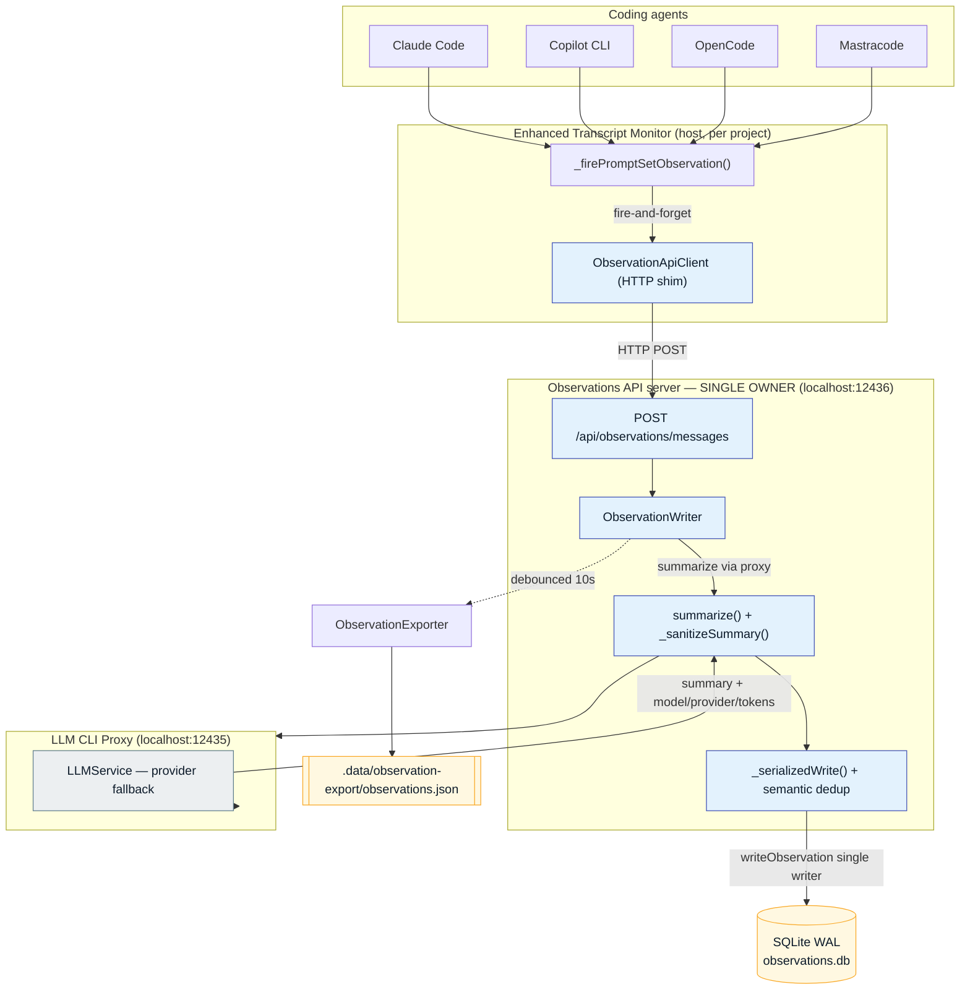
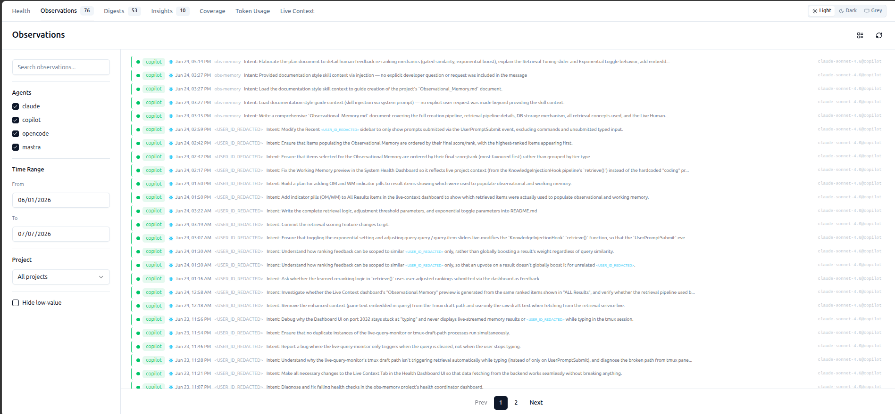
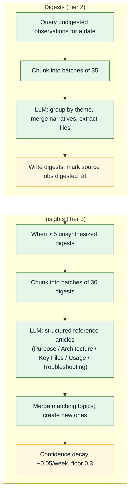
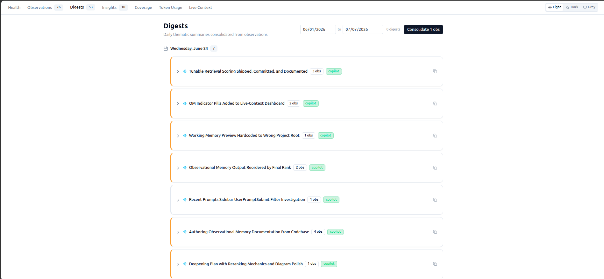
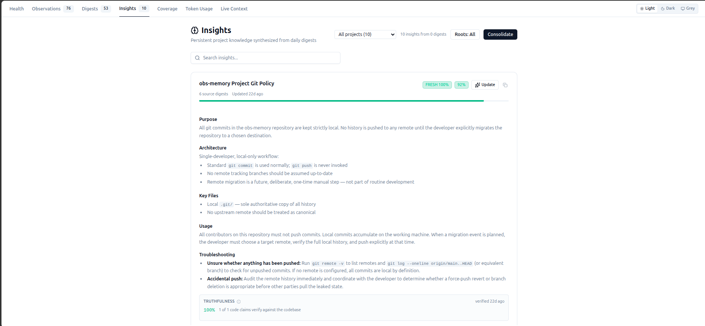

# Ingestion Pipeline

The ingestion (write) path captures every completed agent exchange, turns it into a structured
summary, deduplicates it, persists it, and later consolidates it into higher tiers.

!!! info "Source of truth"
    All ingestion runs **in-process** inside the host Observations API server
    ([`scripts/observations-api-server.mjs`](https://cc-github.bmwgroup.net/ritwikghosh/Agent-Agnostic-Observational-Memory/blob/main/scripts/observations-api-server.mjs), port `12436`).

## End-to-end write flow



1. **Exchange completed** — the ETM detects a completed prompt-set (user + assistant messages).
2. **Fire-and-forget over HTTP** — `_firePromptSetObservation()` calls
   `ObservationApiClient.processMessages()`, which `POST`s `/api/observations/messages` to the host
   obs-api. It is never awaited and never blocks the live session log.
3. **LLM summarization** — `ObservationWriter` calls the LLM proxy (subscription-first routing:
   Claude Code → Copilot → Groq → Anthropic → OpenAI) to produce a structured
   **Intent / Approach / Artifacts / Result** summary.
4. **Sanitization** — `_sanitizeSummary()` strips unfilled template placeholders and LLM
   self-correction artifacts.
5. **Serialized write** — `_serializedWrite()` acquires a promise-chain lock to prevent TOCTOU
   races between concurrent calls.
6. **Dedup** — content-hash + semantic keyword similarity over a 4-hour sliding window.
7. **Storage** — the observation is written to SQLite (WAL) with metadata (agent, project, LLM
   model/provider, tokens). The obs-api holds the only RW handle in the system.
8. **JSON export** — a debounced (10s coalesce) export to the git-tracked JSON files.

## Deduplication layers

| Layer | Method | Threshold |
|-------|--------|-----------|
| **Content hash** | MD5 of `sessionId \| userContent \| assistantContent` | Exact match → reject |
| **Semantic** | Stemmed keyword Jaccard / containment over a 4h window (≤50 obs/agent) | Jaccard > 0.4 **or** containment > 0.7 |
| **Trivial filter** | Substring match ("no actionable content") | Pattern match → reject |
| **Sanitization** | Discard unfilled placeholders like `[what the developer…]` | Pattern match → strip |

## Storage schema

```sql
CREATE TABLE observations (
  id TEXT PRIMARY KEY,
  summary TEXT,          -- Intent / Approach / Artifacts / Result
  messages TEXT,         -- JSON array
  agent TEXT,            -- claude | copilot | opencode | mastra
  session_id TEXT,
  source_file TEXT,
  created_at TEXT,       -- ISO 8601
  metadata TEXT,         -- JSON: project, llmModel, llmProvider, llmTokens
  content_hash TEXT,     -- MD5 dedup key
  quality TEXT,          -- high | normal | low
  digested_at TEXT       -- set on consolidation
);
```

A SQLite **FTS5** virtual table (`observations_fts`) is kept in sync via INSERT/UPDATE/DELETE
triggers and powers the keyword branch of retrieval.



## Consolidation — observations → digests → insights



**Digests** (`consolidateDay()`) group a day's observations by theme and merge them into a single
narrative with aggregated `agents` and `files_touched`.

**Insights** (`synthesizeInsights()`, fired when ≥ 5 unsynthesized digests exist) are self-contained
reference articles optimized for context injection. They are deduplicated with cosine (0.88) +
topic-Jaccard (0.60 merge / 0.30 facet) and carry a **confidence** that starts 0.8–0.95 and decays
−0.05/week down to a 0.3 floor.

<div class="grid cards" markdown>
- 
- 
</div>

## Truthfulness verification

Each insight extracts backticked claims (paths, function names, API routes) and verifies them
against the live codebase on a 7-day cadence. The resulting `verificationRatio` feeds directly into
retrieval ranking:

| State | Ratio | Effect on retrieval |
|-------|-------|---------------------|
| **FRESH** | ≥ 0.70 | Full tier weight |
| **PARTIAL** | 0.50–0.70 | `rrfScore *= 0.3 + 0.7 × ratio` |
| **STALE** | < 0.50 | Heavily demoted + confidence penalty (−0.20, floor 0.30) |

After each consolidation the obs-api publishes a fire-and-forget `embedding:new` event, triggering
an async embedding backfill into Qdrant (see [Retrieval](retrieval.md)).

---

*Continue to [Working Memory](working-memory.md) or [Live Context Retrieval](retrieval.md). Back to the [repository](https://cc-github.bmwgroup.net/ritwikghosh/Agent-Agnostic-Observational-Memory).*
