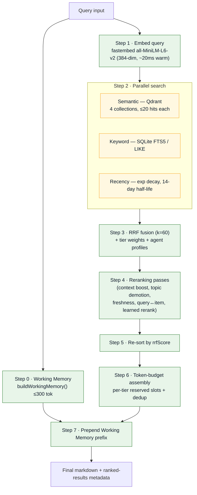
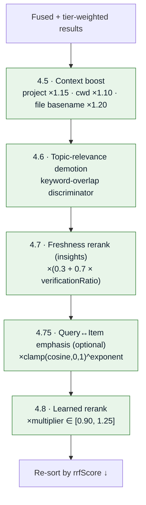
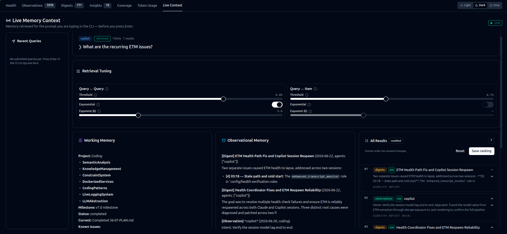

# Live Context Retrieval

The read path answers a single question on every prompt: *what memory is most relevant right now?*
It embeds the query, searches three signals in parallel, fuses them with Reciprocal Rank Fusion,
runs a sequence of reranking passes, budgets the result, and emits tier-tagged markdown — prefixed
with [Working Memory](memory-retention.md#working-memory-the-always-on-prefix).

!!! info "Entry point"
    `POST /api/retrieve` on the host obs-api → `RetrievalService.retrieve(query, options)` in
    [`src/retrieval/retrieval-service.js`](https://bmw.ghe.com/Ritwik-GA-Ghosh/Agent-Agnostic-Observational-Memory/blob/main/src/retrieval/retrieval-service.js).
    Defaults: `scoreThreshold = 0.70`, `defaultBudget = 1000` tokens.

## The 8-stage pipeline



## Step 1 — Embedding

- **Model:** `all-MiniLM-L6-v2` (384-dimensional, cosine distance) via `fastembed` (ONNX, lazy-loaded).
- **API:** `embedOne(text)` (~20 ms warm) and `embedBatch(texts, batchSize=64)` for backfill.

## Step 2 — Parallel search

### Semantic (Qdrant)

Five collections, all 384-dim / cosine:

| Collection | Tier weight | Payload indexes |
|------------|-------------|-----------------|
| `insights` | 1.5 | `topic`, `confidence` |
| `digests` | 1.2 | `quality`, `date` |
| `kg_entities` | 1.0 | `entityType`, `hierarchyLevel` |
| `observations` | 0.8 | `agent`, `quality`, `project`, `date` |
| `human_rerank_feedback` | — | learned-rerank events |

Search is `qdrant.search(collection, vector, { limit: 20, score_threshold: 0.70 })`.

### Keyword (SQLite FTS5 / LIKE)

`KeywordSearch.search(db, query)` returns `{ observations, digests, insights }`:

- **Observations** — FTS5 `MATCH`, falling back to `summary LIKE ?`.
- **Digests** — `LIKE` on `summary` and `theme`.
- **Insights** — `LIKE` on `summary` and `topic`.

### Recency

```javascript
// Half-life = 14 days
function recencyScore(dateStr, halfLifeDays = 14) {
  const ageDays = (Date.now() - new Date(dateStr)) / (1000 * 60 * 60 * 24);
  return Math.pow(0.5, ageDays / halfLifeDays);
}
```

`buildRecencyList()` dedups by id and sorts descending — this is the third input list to RRF.

## Step 3 — Reciprocal Rank Fusion

RRF combines the semantic, keyword, and recency lists by **rank**, not raw score — which keeps
incomparable score scales (cosine vs. FTS5 vs. time-decay) commensurable.

$$
\text{rrf}(item) = \sum_{L \in \text{lists}} \frac{1}{k + \text{rank}_L(item) + 1}, \quad k = 60
$$

So rank 1 contributes `1/(60+0+1) = 0.0164`, rank 100 contributes `1/(60+99+1) = 0.00625`.
Implemented in
[`src/retrieval/rrf-fusion.js`](https://bmw.ghe.com/Ritwik-GA-Ghosh/Agent-Agnostic-Observational-Memory/blob/main/src/retrieval/rrf-fusion.js)
as `rrfFuse(rankedLists, k = 60, agentProfile = null)`.

### Tier weighting

Applied **after** fusion:

```javascript
export const TIER_WEIGHTS = {
  insights:    1.5,
  digests:     1.2,
  kg_entities: 1.0,
  observations: 0.8,
};
// entry.score *= TIER_WEIGHTS[entry.item.tier] ?? 1.0;
```

Optional **agent profiles** ([`config/agent-profiles.json`](https://bmw.ghe.com/Ritwik-GA-Ghosh/Agent-Agnostic-Observational-Memory/blob/main/config/agent-profiles.json))
apply a second per-agent multiplier pass, letting different agents favour different tiers.

## Step 4 — Reranking passes

All passes mutate `rrfScore` in place, then results are re-sorted. The final pass — **learned
rerank** — is the human-feedback loop documented in full on the
[Human-in-the-Loop](human-in-the-loop.md) tab.



### 4.5 Context boost

| Signal | Multiplier |
|--------|-----------|
| Same project | ×1.15 |
| Different project | ×0.5 |
| Current-working-directory path segment match | ×1.10 |
| Recent file basename match | ×1.20 |

### 4.6 Topic-relevance demotion

MiniLM cosines cluster tightly (0.75–0.82) within one project, so raw similarity cannot discriminate
on its own. Keywords are extracted from the query and each result's topic/theme, and off-topic hits
(low Jaccard overlap) are demoted multiplicatively.

### 4.7 Freshness rerank (insights only)

```javascript
rrfScore *= (0.3 + 0.7 * verificationRatio);
```

- **FRESH** (≥ 0.70) → ×1.0 · **PARTIAL** (0.50–0.70) → ×0.65–1.0 · **STALE** (< 0.50) → ×0.3.

See [truthfulness verification](memory-retention.md#truthfulness-freshness-verification).

### 4.75 Query↔Item emphasis (optional)

```javascript
// retrieval-settings.queryItem.exponentialEnabled (default false)
rrfScore *= clamp(cosine, 0, 1) ** exponent;   // exponent default 3.0, range [1.0, 8.0]
```

Steepens the falloff for loosely-related items so near-duplicates dominate. Persisted to
`.observations/retrieval-settings.json`, tunable from the dashboard (see
[Human-in-the-Loop → Retrieval tuning](human-in-the-loop.md#retrieval-tuning-controls)), fail-open
to env defaults.

### 4.8 Learned rerank

The human-feedback boost — a bounded, decaying, confidence-weighted multiplier ∈ `[0.90, 1.25]`
applied only to items already in the fused candidate list. Documented in full on the
[Human-in-the-Loop](human-in-the-loop.md) tab.

## Steps 6–7 — Budget & assembly

```javascript
const TIER_ORDER = ['insights', 'digests', 'kg_entities', 'observations'];
const MIN_TIER_SLOTS = 1;                 // guarantee ≥1 slot per non-empty tier
const TIER_MAX_RESULTS = { insights: 4, digests: 3, kg_entities: 3, observations: 3 };
```

`assembleBudgetedMarkdown()` walks RRF-sorted results highest-score-first under a **1000-token**
budget, skips tiers that hit their cap and duplicate content signatures (~120-char preview),
truncates to fit the remaining budget (breaks below ~50 tokens), then emits tier-tagged markdown.
**Why reservations?** Without them, low-weight observations (which appear in all three lists) would
monopolize the budget and starve high-value insights. The [Working Memory](memory-retention.md#working-memory-the-always-on-prefix)
prefix (≤ 300 tokens) is prepended last.

```
## Working Memory
...
## Insights
...
## Digests
...
```

## Live context preview

The dashboard's **Live Memory Context** surface lets you type a query and watch this entire pipeline
execute in real time — the same code path the `UserPromptSubmit` hook uses in production.



Results are grouped by origin so you can see exactly what the agent will receive:

- **Working Memory** — the always-on ≤ 300-token prefix.
- **Observational Memory** — insights, digests, and observations that survived fusion + budgeting.
- **All Results** — the full ranked candidate set before budget truncation, for inspection.

Each row shows its **tier tag** and explainability badges — the **RRF** contribution and the final
**SCORE** after every reranking pass — so a change to a tuning slider visibly reorders the list. The
live drag-to-reorder feedback and its tuning console are covered on the
[Human-in-the-Loop](human-in-the-loop.md) tab.

---

*Continue to [Human-in-the-Loop](human-in-the-loop.md). Back to the [repository](https://bmw.ghe.com/Ritwik-GA-Ghosh/Agent-Agnostic-Observational-Memory).*
