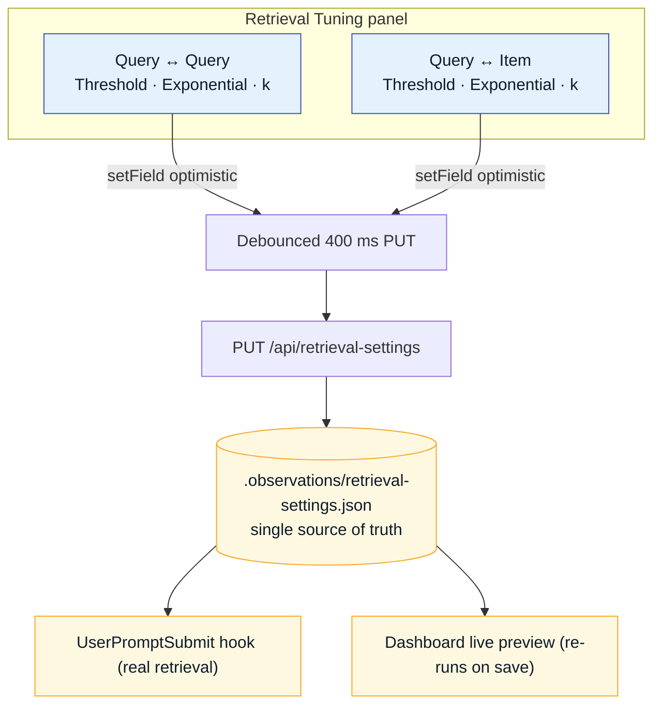

# Live Context Preview

The dashboard's **Live Memory Context** surface lets you type a query and watch the full retrieval
pipeline execute in real time — the same code path the `UserPromptSubmit` hook uses in production.
It doubles as the tuning console for the ranking machinery described on the
[Ranking & Nuances](ranking.md) page.

## Anatomy of the surface

### 1. Query bar & theme control

Type any query to run a live retrieval. The header's theme control toggles between the
**deep translucent dark** default and the **light** palette (top-right of the site chrome).

### 2. Retrieval Tuning panel

Two symmetrical groups drive the reranking passes. Edits are optimistic in the UI and persisted via
a **debounced 400 ms `PUT /api/retrieval-settings`** to
`.observations/retrieval-settings.json` — the single source of truth read by both the live preview
and the real `UserPromptSubmit` hook.

| Control | Role |
|---------|------|
| **Query ↔ Query · Threshold** | Gate 1 admission floor for the [learned-rerank](ranking.md#4-learned-reranking-live-human-feedback-loop) feedback events (default 0.85). |
| **Query ↔ Query · Exponential / k** | Gate 2 reshape of admitted feedback events (`similarity^k`, k = 3). |
| **Query ↔ Item · Threshold** | Semantic admission floor for retrieved items. |
| **Query ↔ Item · Exponential / k** | Optional [query↔item emphasis](ranking.md#475-queryitem-emphasis-optional) (`cosine^exponent`). |

### 3. Result panels

Results are grouped by origin so you can see exactly what the agent will receive:

- **Working Memory** — the always-on ≤ 300-token prefix ([details](working-memory.md)).
- **Observational Memory** — insights, digests, and observations that survived fusion + budgeting.
- **All Results** — the full ranked candidate set before budget truncation, for inspection.

Each row shows its **tier tag** and explainability badges — the **RRF** contribution and the final
**SCORE** after every reranking pass — so a change to a slider visibly reorders the list.

### 4. Human re-ranking → learned feedback

Drag rows to the order you *wanted*, then **Save ranking**. This fires
`POST /api/rerank-feedback`, which embeds the query and upserts a single point into the
`human_rerank_feedback` Qdrant collection. The next time a **similar** query arrives, the learned
signal nudges these items (multiplier ∈ [0.90, 1.25]). This is the capture half of the
[learned reranking loop](ranking.md#4-learned-reranking-live-human-feedback-loop).

## Why a live preview matters

Because the preview reads and writes the **same** settings file as the production hook, tuning is
never guesswork: you adjust a threshold, watch the ordering change against real memory, and the
exact configuration you settled on is what the agent uses on the next prompt.

---

*Back to the [Overview](index.md) or the [repository](https://cc-github.bmwgroup.net/ritwikghosh/Agent-Agnostic-Observational-Memory).*
