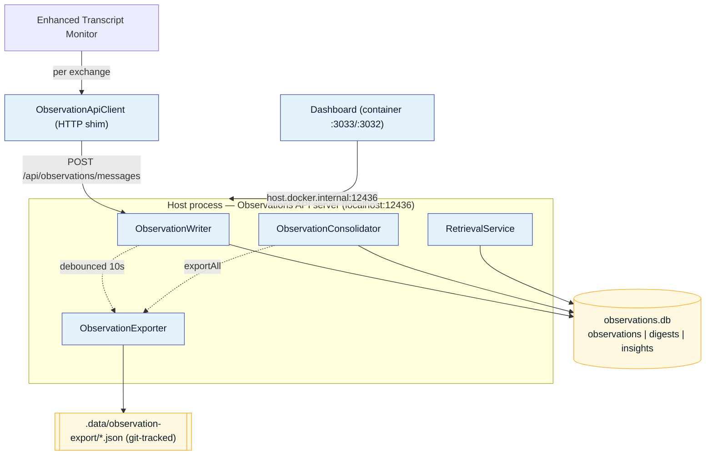
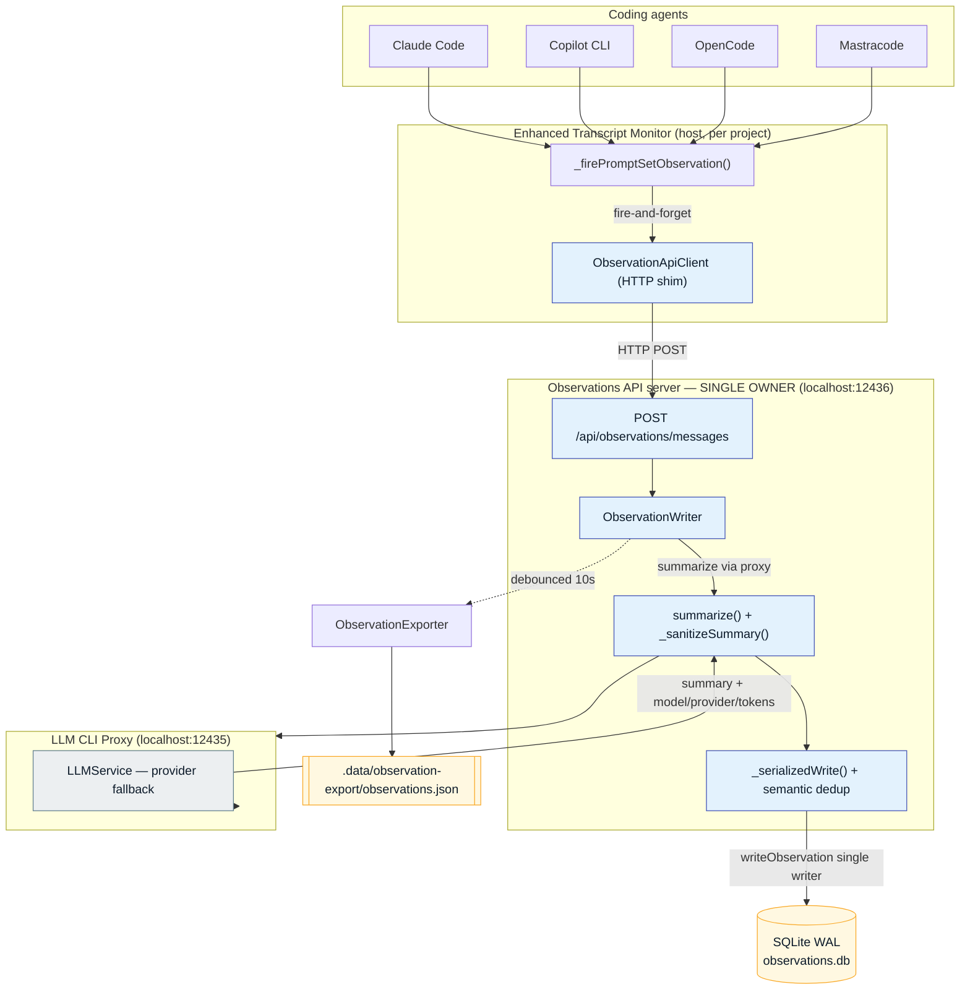
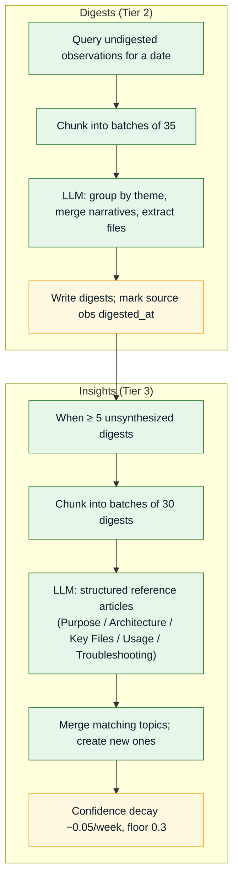
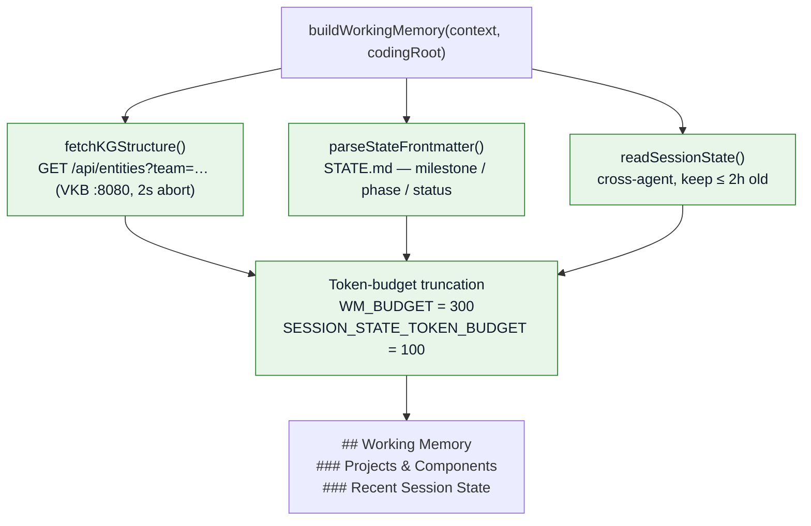

# Memory Retention

Memory retention is the **write path**: every completed agent exchange is summarized,
deduplicated, and persisted — then consolidated into higher tiers and continuously re-verified
against the live codebase. This tab also covers **Working Memory**, the always-on context prefix
assembled at query time.

!!! abstract "Scope"
    This documentation covers **only** Observational Memory retention/retrieval and Working Memory.
    All retention runs **in-process** inside the host Observations API server
    ([`scripts/observations-api-server.mjs`](https://github.com/ritwik-ghosh09/Agent-Agnostic-Observational-Memory/blob/main/scripts/observations-api-server.mjs), port `12436`).

## Three-tier memory hierarchy

Inspired by Mastra's Observer/Reflector hierarchy, adapted for cross-agent project knowledge:

| Tier | What | Trigger | Volume |
|------|------|---------|--------|
| **Observations** | Per-exchange structured summaries (Intent / Approach / Artifacts / Result) | Real-time, per prompt-set | ~30/day |
| **Digests** | Daily thematic work-session summaries | End of day (cron or manual) | ~7/day |
| **Insights** | Persistent, self-verifying project knowledge | Weekly or ≥ 5 new digests | ~10 total |

Each tier is queryable independently and all contribute to retrieval, but with different **tier
weights** (insights count most; raw observations least).

## Single-owner architecture

The runtime DB has exactly **one owner**: the host **Observations API server**. Every other
consumer (transcript monitor, dashboard, consolidator, retrieval) reaches `observations.db` **only**
through this HTTP service. The `.observations` directory is **not** bind-mounted into the container.

This eliminates the classic SQLite-on-Docker-Desktop WAL/SHM corruption pattern where a host writer
and a container reader lose coherence across the bind-mount boundary. "One writer, everyone else
over HTTP."



## End-to-end write flow



1. **Exchange completed** — the ETM detects a completed prompt-set (user + assistant messages).
2. **Fire-and-forget over HTTP** — `_firePromptSetObservation()` calls
   `ObservationApiClient.processMessages()`, which `POST`s `/api/observations/messages` to the host
   obs-api. It is never awaited and never blocks the live session log.
3. **LLM summarization** — `ObservationWriter` calls the LLM proxy (subscription-first routing:
   Claude Code → Copilot → Groq → Anthropic → OpenAI) to produce a structured
   **Intent / Approach / Artifacts / Result** summary.
4. **Sanitization** — `_sanitizeSummary()` strips unfilled template placeholders and LLM
   self-correction artifacts.
5. **Serialized write** — `_serializedWrite()` acquires a promise-chain lock to prevent TOCTOU
   races between concurrent calls.
6. **Dedup** — content-hash + semantic keyword similarity over a 4-hour sliding window.
7. **Storage** — the observation is written to SQLite (WAL) with metadata (agent, project, LLM
   model/provider, tokens). The obs-api holds the only RW handle in the system.
8. **JSON export** — a debounced (10s coalesce) export to the git-tracked JSON files.


## Deduplication layers

Observations are deduplicated **before** storage at several levels:

| Layer | Method | Threshold |
|-------|--------|-----------|
| **Content hash** | MD5 of `sessionId \| userContent \| assistantContent` | Exact match → reject |
| **Semantic** | Stemmed keyword Jaccard / containment over a 4h window (≤50 obs/agent) | Jaccard > 0.4 **or** containment > 0.7 |
| **Trivial filter** | Substring match ("no actionable content") | Pattern match → reject |
| **Sanitization** | Discard unfilled placeholders like `[what the developer…]` | Pattern match → strip |

## Storage mechanism — where everything lives

Three coordinated stores: **SQLite** for structured records, **Qdrant** for vector search, and
**git-tracked JSON** for portability.

### SQLite — the single-owner runtime store

```sql
CREATE TABLE observations (
  id TEXT PRIMARY KEY,
  summary TEXT,          -- Intent / Approach / Artifacts / Result
  messages TEXT,         -- JSON array
  agent TEXT,            -- claude | copilot | opencode | mastra
  session_id TEXT,
  source_file TEXT,
  created_at TEXT,       -- ISO 8601
  metadata TEXT,         -- JSON: project, llmModel, llmProvider, llmTokens
  content_hash TEXT,     -- MD5 dedup key
  quality TEXT,          -- high | normal | low
  digested_at TEXT       -- set on consolidation
);

CREATE TABLE digests (
  id TEXT PRIMARY KEY,
  date TEXT NOT NULL,             -- YYYY-MM-DD
  theme TEXT NOT NULL,
  summary TEXT NOT NULL,          -- consolidated narrative
  observation_ids TEXT NOT NULL,  -- JSON array of source observation IDs
  agents TEXT,                    -- JSON array
  files_touched TEXT,             -- JSON array
  quality TEXT DEFAULT 'normal',
  created_at TEXT NOT NULL,
  metadata TEXT
);

CREATE TABLE insights (
  id TEXT PRIMARY KEY,
  topic TEXT NOT NULL,
  summary TEXT NOT NULL,          -- living knowledge document
  confidence REAL DEFAULT 0.8,    -- decays -0.05/week, floor 0.3
  digest_ids TEXT NOT NULL,       -- JSON array of source digest IDs
  last_updated TEXT NOT NULL,
  created_at TEXT NOT NULL,
  metadata TEXT                   -- JSON: incl. codeVerification.verificationRatio
);
```

A SQLite **FTS5** virtual table (`observations_fts`) is kept in sync via INSERT/UPDATE/DELETE
triggers and powers the keyword branch of retrieval.

### Qdrant — the vector store

Five collections, all **384-dimensional Cosine** (matching `all-MiniLM-L6-v2`):

| Collection | Purpose |
|------------|---------|
| `insights` | Insight embeddings (tier weight 1.5) |
| `digests` | Digest embeddings (tier weight 1.2) |
| `kg_entities` | Knowledge-graph entity embeddings (tier weight 1.0) |
| `observations` | Observation embeddings (tier weight 0.8) |
| `human_rerank_feedback` | One point per human rerank event (see [Human-in-the-Loop](human-in-the-loop.md)) |

### Git-tracked JSON export

| File | Content |
|------|---------|
| `observations.json` | Summaries + metadata (excludes raw `messages`) |
| `digests.json` | Daily thematic digests |
| `insights.json` | Persistent insights + confidence |
| `metadata.json` | Export timestamp + counts |

Triggers: after each write (debounced 10 s, observations only), and a full `exportAll()` after each
consolidation run.

## Consolidation — observations → digests → insights

Consolidation runs **in-process inside the obs-api server** (it already owns the SQLite handle, so
there is no second writer and no WAL race). It produces the two higher tiers.



**Digests** (`consolidateDay()`) group a day's observations by theme and merge them into a single
narrative with aggregated `agents` and `files_touched`. Observations carry a `project` column, so a
session touching two projects yields two digests (no cross-project blending).

**Insights** (`synthesizeInsights()`, fired when ≥ 5 unsynthesized digests exist) are self-contained
reference articles optimized for context injection. They are deduplicated with cosine (0.88) +
topic-Jaccard (0.60 merge / 0.30 facet) and carry a **confidence** that starts 0.8–0.95 and decays
−0.05/week down to a 0.3 floor.

<div class="grid cards" markdown>
- 
- 
</div>

## Truthfulness & freshness verification

Insights age — a renamed file or moved route makes the prose silently rot. The verifier extracts
every backticked code claim (paths, `funcName()`, env vars, `GET /api/…` routes, `@scoped/pkg`) and
checks each against the live codebase (repo + submodules + sibling `_work/*` checkouts), re-running
on a 7-day cadence.

`verificationRatio = verifiedClaims / totalClaims` is bucketed into bands that directly affect
retrieval:

| State | Ratio | Effect on retrieval |
|-------|-------|---------------------|
| **FRESH** | ≥ 0.70 | Full tier weight |
| **PARTIAL** | 0.50–0.70 | `rrfScore *= 0.3 + 0.7 × ratio` |
| **STALE** | < 0.50 | Heavily demoted + confidence penalty (−0.20, floor 0.30) |

After each consolidation the obs-api publishes a fire-and-forget `embedding:new` event, triggering
an async embedding backfill into Qdrant — feeding the [Live Context Retrieval](live-context-retrieval.md) read path.

## Working Memory — the always-on prefix

Working memory is a small, **always-on prefix** (≤ 300 tokens) prepended to every retrieval result.
It primes the agent with current cross-agent session state and project structure before the
semantic results are appended.

!!! note "Fail-open by design"
    If VKB is unreachable or `STATE.md` is missing, `buildWorkingMemory()` returns an empty prefix
    and lets semantic search use the full token budget. Working memory never blocks retrieval.

### What it contains

1. **Cross-agent session state** — current milestone / phase / status from `STATE.md` frontmatter.
2. **Project context** — VKB knowledge-graph entities (Projects, Components).
3. **Recency** — only session state ≤ 2 hours old is kept.

### Assembly

Implemented in
[`src/retrieval/working-memory.js`](https://github.com/ritwik-ghosh09/Agent-Agnostic-Observational-Memory/blob/main/src/retrieval/working-memory.js)
via `buildWorkingMemory(context, codingRoot)`.



| Constant | Value | Meaning |
|----------|-------|---------|
| `WM_BUDGET` | 300 | Firm token ceiling for the whole prefix |
| `SESSION_STATE_TOKEN_BUDGET` | 100 | Sub-budget for the session-state block |
| `VKB_TIMEOUT` | 2000 ms | Abort VKB fetch after 2s (fail-open) |
| `SESSION_STATE_MAX_AGE_MS` | 2 h | Discard stale session state |

`STATE.md` roots are tried in order — `context.cwd`, `context.codingRoot`, then the `CODING_REPO`
env var — and the first that yields parseable frontmatter wins.

```markdown
## Working Memory

### Projects & Components
- [Project: coding] (current_phase/status)
- [Component: retrieval-service]

### Recent Session State
- Current milestone: Phase 6
- Last action: Deployed live context preview
```

### Working memory vs. observational memory

| Aspect | Observational Memory | Working Memory |
|--------|----------------------|----------------|
| **Scope** | Historical archive, 3-tier hierarchy | Ephemeral, always-on prefix |
| **Retention** | 7+ days (configurable) + cold store | ≤ 2 hours (session state) |
| **Trigger** | Automatic per-exchange + scheduled consolidation | Per-retrieval query |
| **Update cadence** | Real-time ingest, daily/weekly consolidation | Read from VKB + STATE.md at query time |
| **Purpose** | Long-term knowledge accumulation | Context priming for the next prompt |
| **Budget** | Up to the retrieval budget (default 1000 tokens) | Firm 300-token ceiling |

---

*Continue to [Live Context Retrieval](live-context-retrieval.md). Back to the [repository](https://github.com/ritwik-ghosh09/Agent-Agnostic-Observational-Memory).*
