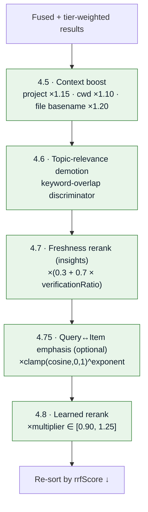
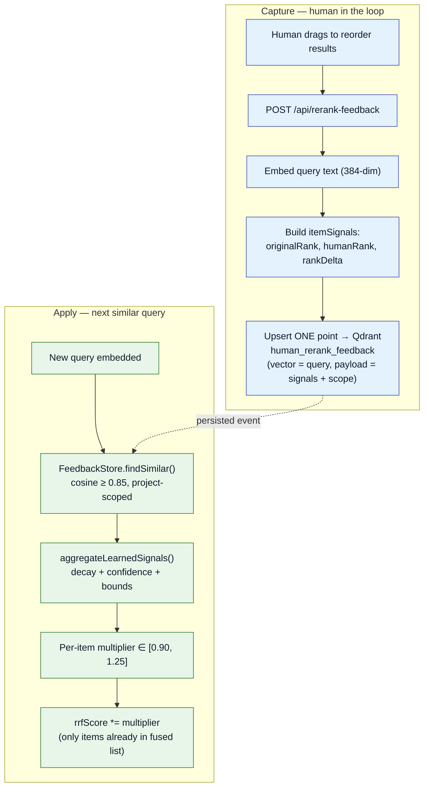

# Ranking & Nuances

This page documents every scoring and reranking mechanism between raw search hits and the final
ordered context. It is the "full-depth" companion to the [retrieval pipeline](retrieval.md).

## 1. RRF fusion score

Reciprocal Rank Fusion combines the semantic, keyword, and recency lists by **rank**, not raw score
— which keeps incomparable score scales (cosine vs. FTS5 vs. time-decay) commensurable.

$$
\text{rrf}(item) = \sum_{L \in \text{lists}} \frac{1}{k + \text{rank}_L(item) + 1}, \quad k = 60
$$

So rank 1 contributes `1/(60+0+1) = 0.0164`, rank 100 contributes `1/(60+99+1) = 0.00625`.
Implemented in
[`src/retrieval/rrf-fusion.js`](https://bmw.ghe.com/Ritwik-GA-Ghosh/Agent-Agnostic-Observational-Memory/blob/main/src/retrieval/rrf-fusion.js)
as `rrfFuse(rankedLists, k = 60, agentProfile = null)`.

## 2. Tier weighting

Applied **after** fusion:

```javascript
export const TIER_WEIGHTS = {
  insights:    1.5,
  digests:     1.2,
  kg_entities: 1.0,
  observations: 0.8,
};
// entry.score *= TIER_WEIGHTS[entry.item.tier] ?? 1.0;
```

Optional **agent profiles** ([`config/agent-profiles.json`](https://bmw.ghe.com/Ritwik-GA-Ghosh/Agent-Agnostic-Observational-Memory/blob/main/config/agent-profiles.json))
apply a second per-agent multiplier pass, letting different agents favour different tiers.

## 3. Reranking passes

All passes mutate `rrfScore` in place, then results are re-sorted.



### 4.5 Context boost

| Signal | Multiplier |
|--------|-----------|
| Same project | ×1.15 |
| Different project | ×0.5 |
| Current-working-directory path segment match | ×1.10 |
| Recent file basename match | ×1.20 |

### 4.6 Topic-relevance demotion

MiniLM cosines cluster tightly (0.75–0.82) within one project, so raw similarity cannot
discriminate on its own. Keywords are extracted from the query and each result's topic/theme, and
off-topic hits (low Jaccard overlap) are demoted multiplicatively.

### 4.7 Freshness rerank (insights only)

```javascript
rrfScore *= (0.3 + 0.7 * verificationRatio);
```

- **FRESH** (≥ 0.70) → ×1.0 · **PARTIAL** (0.50–0.70) → ×0.65–1.0 · **STALE** (< 0.50) → ×0.3.

See [truthfulness verification](ingestion.md#truthfulness-verification).

### 4.75 Query↔Item emphasis (optional)

```javascript
// retrieval-settings.queryItem.exponentialEnabled (default false)
rrfScore *= clamp(cosine, 0, 1) ** exponent;   // exponent default 3.0, range [1.0, 8.0]
```

Steepens the falloff for loosely-related items so near-duplicates dominate. Persisted to
`.observations/retrieval-settings.json`, tunable from the dashboard, fail-open to env defaults.

## 4. Learned reranking (live human-feedback loop)

A human reorders retrieval results in the dashboard; the system learns from it and nudges future
rankings of **similar queries**.



### Aggregation math

```text
similarityWeight = exponentialEnabled ? clamp(score,0,1)^exponent : score
ageWeight        = 0.5 ^ (ageDays / HALF_LIFE_DAYS)        # 45 days
eventWeight      = similarityWeight × ageWeight × scopeWeight × userWeight
deltaNorm        = (originalRank − humanRank) / max(windowSize − 1, 1)
weightedDelta    = Σ(deltaNorm × eventWeight) / max(Σ eventWeight, ε)
confidence       = min(1, Σ|eventWeight| / CONFIDENCE_DIVISOR)   # divisor 1.5
learnedSignal    = clamp(weightedDelta × confidence, −1, 1)
multiplier       = clamp(1 + COEFFICIENT × learnedSignal, MIN, MAX)   # [0.90, 1.25]
```

### The two gates

- **Gate 1 — hard admission floor:** Qdrant `score_threshold ≥ 0.85` (query↔query cosine). Binary
  in/out; below the floor an event is never considered.
- **Gate 2 — exponential emphasis:** within the admitted band (0.85–1.00), reshape
  `weight = similarity ^ k` (k = 3) to stretch the compressed band into a usable spread.

### Tuning constants ([`feedback-store.js`](https://bmw.ghe.com/Ritwik-GA-Ghosh/Agent-Agnostic-Observational-Memory/blob/main/src/retrieval/feedback-store.js), env-overridable)

| Constant | Default | Meaning |
|----------|---------|---------|
| `LEARNED_RERANK_THRESHOLD` | 0.85 | Query↔query similarity floor (Gate 1) |
| `LEARNED_RERANK_TOPK` | 10 | Max feedback events per query |
| `LEARNED_RERANK_HALF_LIFE_DAYS` | 45 | Age decay |
| `LEARNED_RERANK_COEFFICIENT` | 0.30 | Boost coefficient |
| `LEARNED_RERANK_MIN/MAX_MULTIPLIER` | 0.90 / 1.25 | Output bounds |
| `LEARNED_RERANK_SIMILARITY_EXPONENT` | 3.0 | Gate 2 reshape (k) |
| `LEARNED_RERANK_EXPONENTIAL_ENABLED` | true | Enable Gate 2 |

## 5. Token budgeting & assembly

```javascript
const TIER_ORDER = ['insights', 'digests', 'kg_entities', 'observations'];
const MIN_TIER_SLOTS = 1;                 // guarantee ≥1 slot per non-empty tier
const TIER_MAX_RESULTS = { insights: 4, digests: 3, kg_entities: 3, observations: 3 };
```

`assembleBudgetedMarkdown()` walks RRF-sorted results, skips tiers that hit their cap and duplicate
content signatures (~120-char preview), truncates to fit the remaining budget (breaks below ~50
tokens), then emits tier-tagged markdown. **Why reservations?** Without them, low-weight
observations (which appear in all three lists) would monopolize the budget and starve insights.

---

*Continue to the [Live Context Preview](live-context.md). Back to the [repository](https://bmw.ghe.com/Ritwik-GA-Ghosh/Agent-Agnostic-Observational-Memory).*
