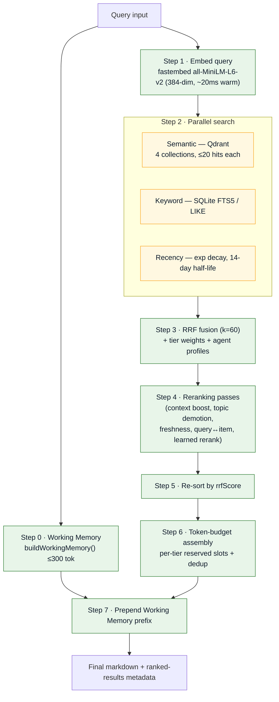

# Live Context Retrieval

The read path answers a single question on every prompt: *what memory is most relevant right now?*
It embeds the query, searches three signals in parallel, fuses them, re-ranks, budgets, and emits
tier-tagged markdown — prefixed with [Working Memory](working-memory.md).

!!! info "Entry point"
    `POST /api/retrieve` on the host obs-api → `RetrievalService.retrieve(query, options)` in
    [`src/retrieval/retrieval-service.js`](https://cc-github.bmwgroup.net/ritwikghosh/Agent-Agnostic-Observational-Memory/blob/main/src/retrieval/retrieval-service.js).
    Defaults: `scoreThreshold = 0.70`, `defaultBudget = 1000` tokens.

## The 8-stage pipeline



## Step 1 — Embedding

- **Model:** `all-MiniLM-L6-v2` (384-dimensional, cosine distance) via `fastembed` (ONNX, lazy-loaded).
- **API:** `embedOne(text)` (~20 ms warm) and `embedBatch(texts, batchSize=64)` for backfill.

## Step 2 — Parallel search

### Semantic (Qdrant)

Five collections, all 384-dim / cosine:

| Collection | Tier weight | Payload indexes |
|------------|-------------|-----------------|
| `insights` | 1.5 | `topic`, `confidence` |
| `digests` | 1.2 | `quality`, `date` |
| `kg_entities` | 1.0 | `entityType`, `hierarchyLevel` |
| `observations` | 0.8 | `agent`, `quality`, `project`, `date` |
| `human_rerank_feedback` | — | learned-rerank events |

Search is `qdrant.search(collection, vector, { limit: 20, score_threshold: 0.70 })`.

### Keyword (SQLite FTS5 / LIKE)

`KeywordSearch.search(db, query)` returns `{ observations, digests, insights }`:

- **Observations** — FTS5 `MATCH`, falling back to `summary LIKE ?`.
- **Digests** — `LIKE` on `summary` and `theme`.
- **Insights** — `LIKE` on `summary` and `topic`.

### Recency

```javascript
// Half-life = 14 days
function recencyScore(dateStr, halfLifeDays = 14) {
  const ageDays = (Date.now() - new Date(dateStr)) / (1000 * 60 * 60 * 24);
  return Math.pow(0.5, ageDays / halfLifeDays);
}
```

`buildRecencyList()` dedups by id and sorts descending — this is the third input list to RRF.

## Step 3 — Reciprocal Rank Fusion

Each ranked list contributes `1 / (k + rank + 1)` (with `k = 60`) to every item; contributions are
summed, then multiplied by the tier weight and any per-agent profile multiplier. Full detail —
including all reranking passes and the learned human-feedback loop — is on the
[Ranking & Nuances](ranking.md) page.

## Steps 6–7 — Budget & assembly

Results are walked highest-score-first and packed under a **1000-token** budget with per-tier
reserved slots so that high-value insights/digests always reach the agent even though low-weight
observations tend to score well. The [Working Memory](working-memory.md) prefix (≤ 300 tokens) is
prepended last.

```
## Working Memory
...
## Insights
...
## Digests
...
```

---

*Continue to [Ranking & Nuances](ranking.md) or the [Live Context Preview](live-context.md). Back to the [repository](https://cc-github.bmwgroup.net/ritwikghosh/Agent-Agnostic-Observational-Memory).*
