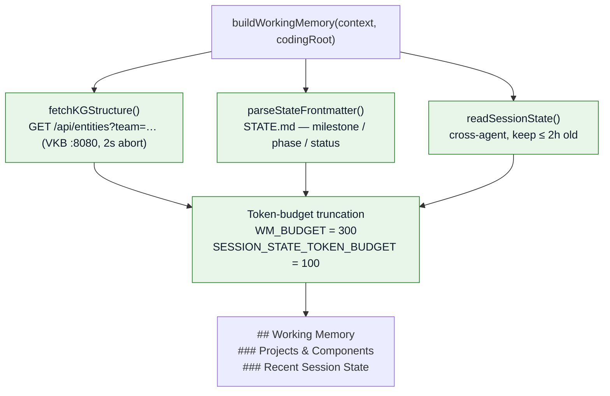

# Working Memory

Working memory is a small, **always-on prefix** (≤ 300 tokens) prepended to every retrieval result.
It primes the agent with current cross-agent session state and project structure before the
semantic results are appended.

!!! note "Fail-open by design"
    If VKB is unreachable or `STATE.md` is missing, `buildWorkingMemory()` returns an empty prefix
    and lets semantic search use the full token budget. Working memory never blocks retrieval.

## What it contains

1. **Cross-agent session state** — current milestone / phase / status from `STATE.md` frontmatter.
2. **Project context** — VKB knowledge-graph entities (Projects, Components).
3. **Recency** — only session state ≤ 2 hours old is kept.

## Assembly

Implemented in
[`src/retrieval/working-memory.js`](https://bmw.ghe.com/Ritwik-GA-Ghosh/Agent-Agnostic-Observational-Memory/blob/main/src/retrieval/working-memory.js)
via `buildWorkingMemory(context, codingRoot)`.



| Constant | Value | Meaning |
|----------|-------|---------|
| `WM_BUDGET` | 300 | Firm token ceiling for the whole prefix |
| `SESSION_STATE_TOKEN_BUDGET` | 100 | Sub-budget for the session-state block |
| `VKB_TIMEOUT` | 2000 ms | Abort VKB fetch after 2s (fail-open) |
| `SESSION_STATE_MAX_AGE_MS` | 2 h | Discard stale session state |

`STATE.md` roots are tried in order — `context.cwd`, `context.codingRoot`, then the `CODING_REPO`
env var — and the first that yields parseable frontmatter wins.

### Example output

```markdown
## Working Memory

### Projects & Components
- [Project: coding] (current_phase/status)
- [Component: retrieval-service]

### Recent Session State
- Current milestone: Phase 6
- Last action: Deployed live context preview
```

## Working memory vs. observational memory

| Aspect | Observational Memory | Working Memory |
|--------|----------------------|----------------|
| **Scope** | Historical archive, 3-tier hierarchy | Ephemeral, always-on prefix |
| **Retention** | 7+ days (configurable) + cold store | ≤ 2 hours (session state) |
| **Trigger** | Automatic per-exchange + scheduled consolidation | Per-retrieval query |
| **Update cadence** | Real-time ingest, daily/weekly consolidation | Read from VKB + STATE.md at query time |
| **Purpose** | Long-term knowledge accumulation | Context priming for the next prompt |
| **Budget** | Up to the retrieval budget (default 1000 tokens) | Firm 300-token ceiling |

---

*Continue to [Live Context Retrieval](retrieval.md). Back to the [repository](https://bmw.ghe.com/Ritwik-GA-Ghosh/Agent-Agnostic-Observational-Memory).*
